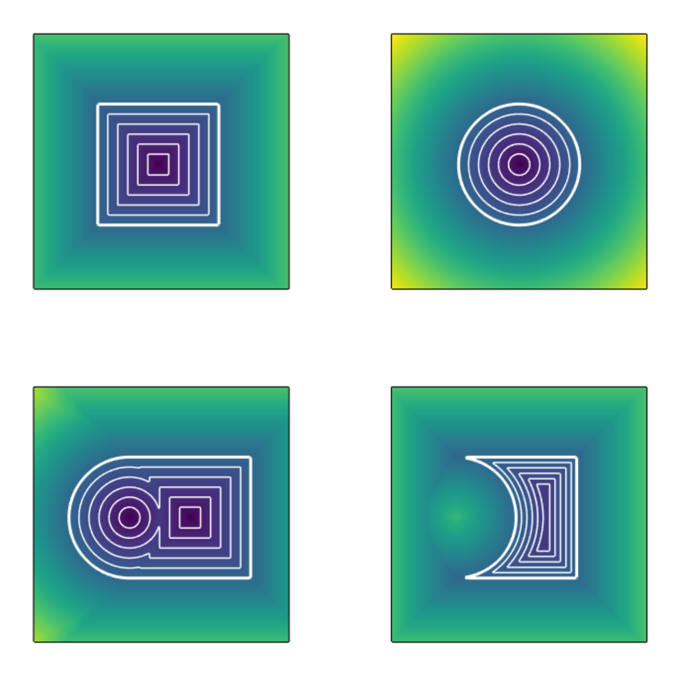
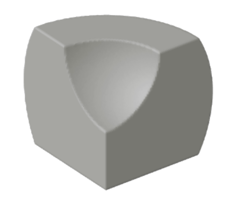
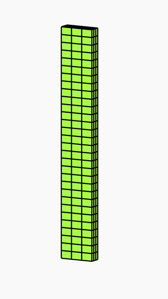
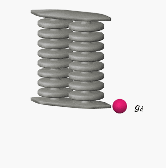
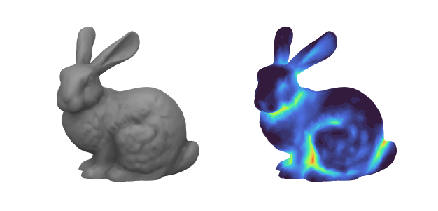
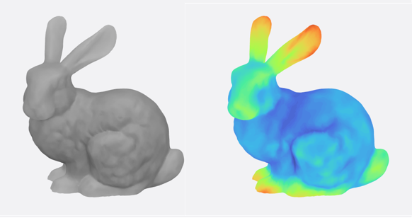

<div align="center">  </div> <br/>

[**Sorotoki**](https://bjcaasenbrood.github.io/SorotokiCode/) is an open-source MATLAB toolkit for soft robotics that includes an array of tools for design, modeling, and control. Due to its scientific diversity, it can be challenging for new researchers to quickly familiarize themselves with multiple scientific areas. With the aim to lower this threshold, Sorotoki aims to incorporate multiple layers of soft robotics research into one compact toolkit. Examples include: continuum mechanics, dynamic systems and control theory, topology optimization, computer graphics, and much more to come! The combination provides a highly flexible programming environment and will hopefully aid the development of novel soft robotic research.

#### Download the latest stable version (v1.03):

```bash
git clone --depth 1  https://github.com/BJCaasenbrood/SorotokiCode.git
```

## Installation
Please visit [**Sorotoki**](https://bjcaasenbrood.github.io/SorotokiCode/) for the installation intruction. If any future updates may occur, just simply run *sorotoki.m*, and the toolkit will automatically tell you which files are out-of-date.

## Applications highlights

- [x] Implicit modeling with Signed Distance Functions (SDFs),
- [x] Finite element method (FEM) using hyper-elastic materials,
- [x] Topology optimization of (pressure-driven) soft robots,
- [x] Dynamical modeling through geometric theory,
- [x] (NEW!) Real-time control of soft robots via Raspi-interface,
- [x] Fast graphics rendering with responsive textures.

**REMARK**: All images are produced using only MATLAB and SOROTOKI, no additional software was used!

### Signed Distance Functions and Meshing -- `Sdf.m`, `Mesh.m`

#### SDF: Implicit modeling of 2D-primes: union and subtraction
<details>
<summary>Show image</summary>
<div align="left">  </div>

<a href="https://github.com/BJCaasenbrood/SorotokiCode/blob/master/scripts/mesh/mesh_sdf.m">Code available here</a>
</details>

#### SDF: Implicit modeling of 3D-primes: subtraction and intersection
<details>
<summary>Show image</summary>
<div align="left">  </div>

<a href="https://github.com/BJCaasenbrood/SorotokiCode/blob/master/scripts/gmdl/SDF/preview_sdf.m">Code available here</a>
</details>

#### MESH: Signed distance function (SDF) to mesh
<details>
<summary>Show image</summary>
<div align="left">  </div>
</details>

#### MESH: Polygonal meshing of circular SDF
<details>
<summary>Show image</summary>
<div align="left">  </div>
</details>

### Finite Element Method  -- `Fem.m`

#### FEM: Uni-axial tensile test

<details>
<summary>Show image</summary>
<div align="left">  </div>
</details>

#### FEM: Topology optimization of PneuNet actuator

<details>
<summary>Show image</summary>
<div align="left">  </div>
</details>

#### FEM: Deforming PneuNet actuator -- Ecoflex 0030

<details>
<summary>Show image</summary>
<div align="left">  </div>
</details>

#### FEM: 3D buckling of hyper-elastic beam

<details>
<summary>Show image</summary>
<div align="left">  </div>
</details>


### Dynamic Model  -- `Model.m`

#### MODEL: Simulation of two-link soft robot

<details>
<summary>Show image</summary>
<div align="left">  </div>
</details>

#### MODEL: Energy-based control of planar soft robot

<details>
<summary>Show image</summary>
<div align="left">  </div>
</details>

#### MODEL: Basis reconstruction from FEM-data -- Reduced-order modeling

<details>
<summary>Show image</summary>
<div align="left">  </div>
</details>

### Graphics Model -- `Gmodel.m`

#### GMODEL: Responsive rendering of the Stanford bunny

<details>
<summary>Show image</summary>
<div align="left">  </div>
</details>

#### GMODEL: Responsive lighting

<details>
<summary>Show image</summary>
<div align="left">  </div>
</details>

#### GMODEL: Rendering ambient occlusion (AO)

<details>
<summary>Show image</summary>
<div align="left">  </div>
</details>

#### GMODEL: Rendering sub-surface scattering (SSS)

<details>
<summary>Show image</summary>
<div align="left">  </div>
</details>

## Citation

If you are planning on using Sorotoki in your (academic) work, please consider citing the toolkit  

```bibtex
@misc{Caasenbrood2018,
  author = {Caasenbrood, Brandon},
  title = {Sorotoki - A Soft Robotics Toolkit for MATLAB},
  year = {2020},
  publisher = {GitHub},
  journal = {GitHub repository},
  howpublished = {\url{https://github.com/BJCaasenbrood/SorotokiCode}},
}
```
