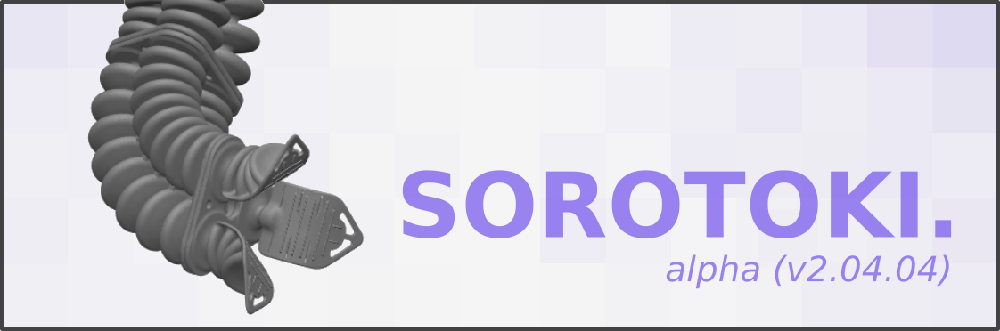

  
  

[**Sorotoki**](https://bjcaasenbrood.github.io/SorotokiCode/) is an open-source MATLAB toolkit for soft robotics that includes an array tools for design, modeling, and control. Due to its scientific diversity, it can be challenging for researchers to quickly learn the different disciplines required for soft robotics. With the aim to lower the multi-disciplinary barrier, Sorotoki aims to incorporate multiple layers of scientific disciplines in one toolkit. Examples include: continuum mechanics, dynamic system- and control theory, topology optimization, computer graphics, and much more to come!

## Installation page
Please visit [**Sorotoki**](https://bjcaasenbrood.github.io/SorotokiCode/) for the installation intruction. If any future updates may occur, just simply run *sorotoki.m*, and the toolkit will automatically tell you which files are out-of-date.
