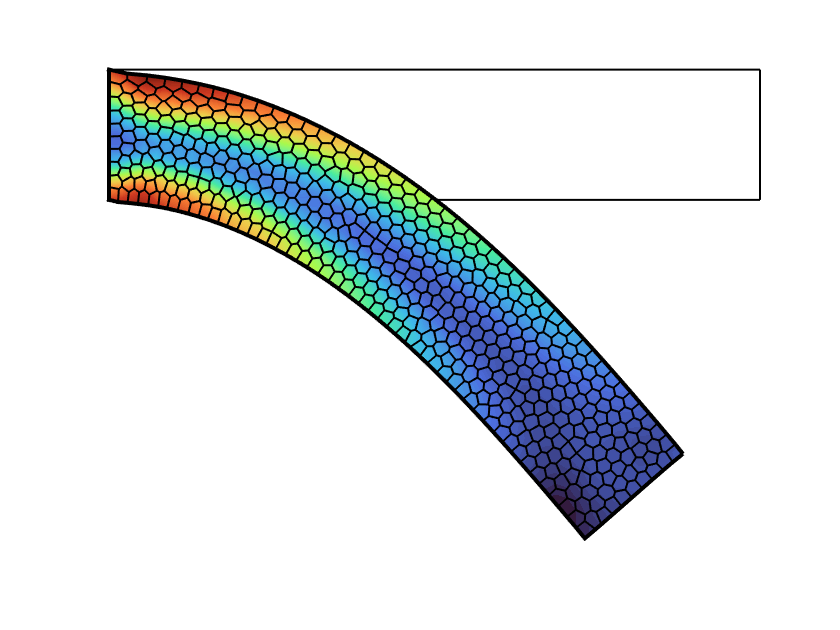

<div align="center">  </div>

# Nonlinear Finite Elements

[**Homepage**](https://bjcaasenbrood.github.io/SorotokiCode/)

### List of material models:
```matlab
% different material models
fem.Material = LinearMaterial('E',-,'Nu',-);           % linear isotropic
fem.Material = NeoHookeanMaterial('E',-,'Nu',-);       % neo-hookean model
fem.Material = MooneyMaterial('C10',-,'C01',-,'K',-);  % mooney-rivlin model
fem.Material = YeohMaterial('C1',-,'C2',-,'C3',-)      % yeoh model
                            
% different preset materials
fem.Material = Ecoflex0030();
fem.Material = Dragonskin20A();   	 
fem.Material = Elastosil();   	 
```

### Example: Beam 
<div align="center">  </div>

```matlab
%% generate mesh from sdf
sdf = @(x) dRectangle(x,0,10,0,2);

msh = Mesh(sdf);
msh = msh.set('BdBox',[0,10,0,2],'NElem',500);
msh = msh.generateMesh;

%% generate fem model from mesh
fem = Fem(msh);
fem = fem.set('TimeStep',1/15,'ResidualNorm',1e-3);

%% add boundary conditions 
fem = fem.AddConstraint('Support',fem.FindNodes('Left'),[1,1]);
fem = fem.AddConstraint('Load',fem.FindNodes('Right'),[0,-1e-3]);

%% assign material
fem.Material = Ecoflex0030;

%% solving
fem.solve();
```
