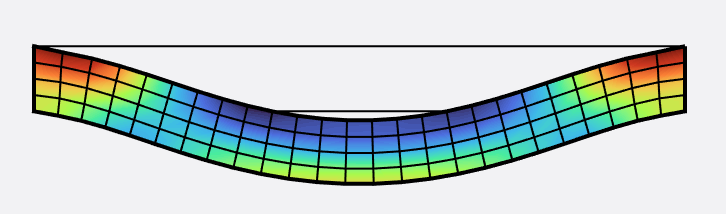

<div align="center">  </div>

# Finite Element Method

[**Homepage**](https://bjcaasenbrood.github.io/SorotokiCode/)

### List of material models:
```matlab
% different material models
fem.Material = LinearMaterial('E',-,'Nu',-);           % linear isotropic
fem.Material = NeoHookeanMaterial('E',-,'Nu',-);       % neo-hookean model
fem.Material = MooneyMaterial('C10',-,'C01',-,'K',-);  % mooney-rivlin model
fem.Material = YeohMaterial('C1',-,'C2',-,'C3',-)      % yeoh model
                            
% different preset materials
fem.Material = Ecoflex0030();
fem.Material = Dragonskin20A();   	 
fem.Material = Elastosil();   	 
```

### Example: Clamped beam 

```matlab
%% generate mesh from sdf
sdf = @(x) dRectangle(x,0,10,0,1);

msh = Mesh(sdf,'BdBox',[0,10,0,1],'Quads',[25,5]);
msh = msh.generateMesh();

%% generate fem model from mesh
fem = Fem(msh,'TimeStep',1/15);

%% add boundary conditions
fem = fem.AddConstraint('Support',fem.FindNodes('Left'),[1,1]);
fem = fem.AddConstraint('Support',fem.FindNodes('Right'),[1,1]);
fem = fem.AddConstraint('Load',fem.FindNodes('Bottom'),[0,-2e-2]);

%% select material
fem.Material = Dragonskin10A();

%% solving
fem.solve();

```
<div align="center">  </div>


### Example: Tensile bone
```matlab
%% generate mesh from sdf
sdf = @(x) TensileBone(x,8,2,3,1,0.75);

msh = Mesh(sdf,'BdBox',[0,10,0,10],'NElem',500);
msh = msh.generateMesh();

%% generate fem model from mesh
fem = Fem(msh,'TimeStep',1/10,'PrescribedDisplacement',true);

%% add boundary conditions
fem = fem.AddConstraint('Support',fem.FindNodes('Left'),[1,0]);
fem = fem.AddConstraint('Support',fem.FindNodes('Bottom'),[0,1]);
fem = fem.AddConstraint('Load',fem.FindNodes('Top'),[0,4]);

%% assign material
fem.Material = Ecoflex0030();

%% solving
fem.solve();

function D = TensileBone(P,H,W,T,D,R)
dD = 0.5*(W-D);
dT = 0.5*(H-T);

R1 = dRectangle(P,0,W,0,H);
R2 = dRectangle(P,0,dD,dT,dT+T);
R3 = dRectangle(P,W-dD,W,dT,dT+T);
C1 = dCircle(P,dD-R,dT,R);
C2 = dCircle(P,dD-R,dT+T,R);
C3 = dCircle(P,W-dD+R,dT,R);
C4 = dCircle(P,W-dD+R,dT+T,R);
D0 = dDiff(dDiff(dDiff(R1,R2),C1),C2);
D = dDiff(dDiff(dDiff(D0,R3),C3),C4);
end
```
<div align="center">  </div>
