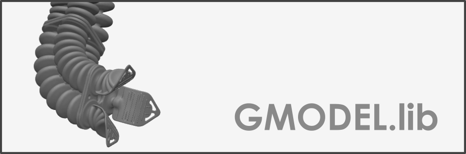
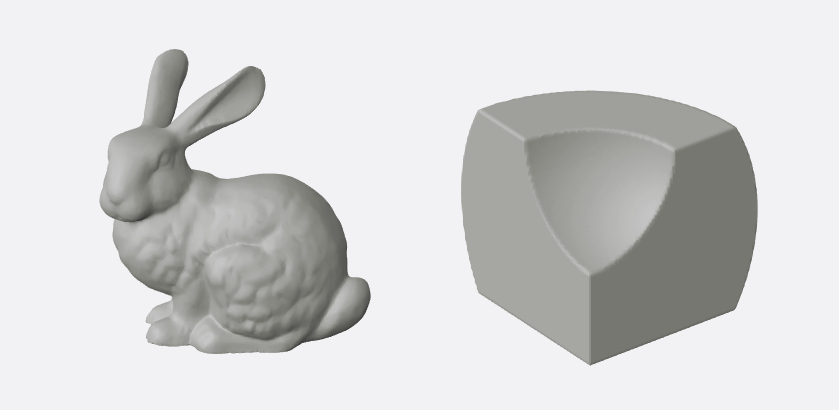
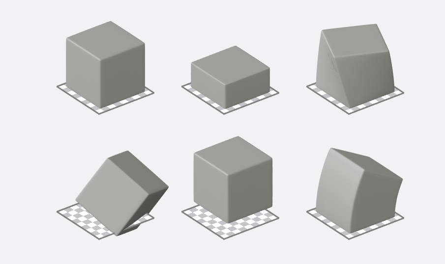
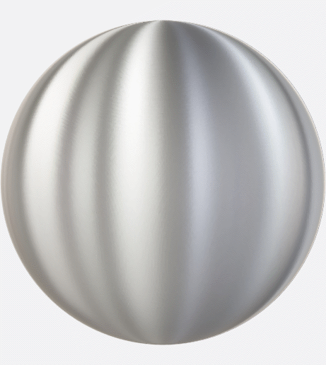
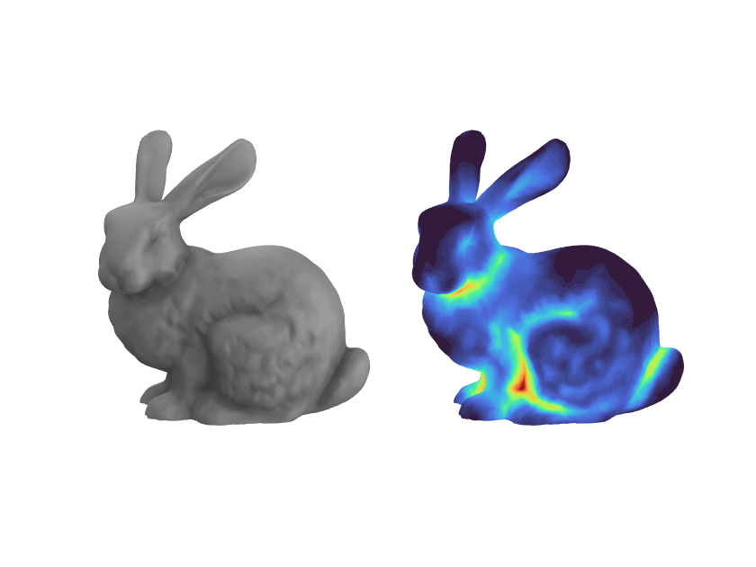
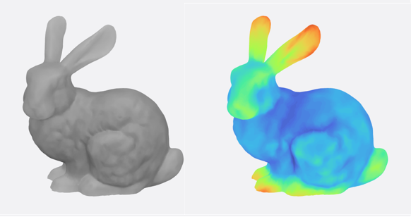

<div align="center">  </div>

# Graphics and Implicit Modeling
[Go back to home page](https://bjcaasenbrood.github.io/SorotokiCode/)

## Loading graphical models
```matlab
%% loading graphical models
obj0 = Gmodel('Bunny.stl');
obj1 = Gmodel(@(x) SDF(x),domain(-0.1,1.1,3));

%% rendering models
figure(101);
subplot(1,2,1); obj0.bake().render(); 
subplot(1,2,2); obj1.bake().render(); 

%% signed distance function (3D)
function Dist = SDF(x)
       C1 = dCube(x,0,1,0,1,0,1);
       S1 = dSphere(x,0,0,1,.5);
       S2 = dSphere(x,0,0,0.5,1);
       Dist = dIntersect(dDiff(C1,S1),S2);
end
```
<div align="center">  </div>

## Transformations
```matlab
%% loading graphical model
obj = Gmodel('Cube.stl');

%% initialize render
figure(101); subplot(2,3,1);
obj.bake().render().update; 
obj.ground();

%% transformations
Blender(obj.reset(),'Scale',{'z',0.5}); 
    subplot(2,3,2); obj.bake().render(); obj.ground();

Blender(obj,'Twist',{'z',30});
    subplot(2,3,3); obj.bake().render(); obj.ground();

Blender(obj.reset(),'Rotate',{'3D',30,20,30});
    subplot(2,3,4); obj.bake().render(); obj.ground();

Blender(obj.reset(),'Translate',{'3D',0.5,0.5,0});
    subplot(2,3,5); obj.bake().render(); obj.ground();
    
Blender(obj.reset(),'Curve',{'PCC',30,0});
    subplot(2,3,6); obj.bake().render(); obj.ground();    
```
<div align="center">  </div>


## Rendering
```matlab
%% loading graphical model
obj = Gmodel(@(x) dSphere(x,0,0,0,1),[-1,1,-1,1,-1,1]);

%% material list
mat = {aniso, bluered, bump, chroma, chromium, ...
       clean, copper, egg, grey, hotmetal, jade, ...
       matcap, mateplastic, metal, metalclean, ...
       oldwax, orangeresin, planet, plastic, ...
       redshine, redwax, retro, rim, soft, ...
       skin, studioclay};

% loop materials
for ii = 1:length(mat)
  pause(0.1);
  obj.Texture = mat{ii};
  if ii == 1, obj.render;
  else, obj.update();
  end
end
```

<div align="center">  </div>

### Ambient occlusion (AO)
```matlab
%% loading graphical model
obj = Gmodel('Bunny.stl');

%% set texture settings
obj.set('Texture',grey,'AO',true,'AOPower',5.0,'AORadius',0.2);
obj.bake().render().update();

%% show AO map 
obj_ = obj.copy('Translate',{'y',100});
obj_.render().showMap('AO');
view(90,15); axis tight;
```
<div align="center">  </div>


### Sub-Surface Scattering (SSS)
```matlab
%% loading graphical model
obj = Gmodel('Bunny.stl');

%% set texture settings
obj.set('Texture',grey,'Emission',[0.70 0.70 0.70],...
        'SSS',true,'SSSPower',1.40,'SSSRadius',0.2);
    
obj.bake().render().update();

%% set AO map object
obj_ = obj.copy('Translate',{'y',100});
obj_.render().showMap('SSS');
view(90,15); axis tight;
```
<div align="center">  </div>
