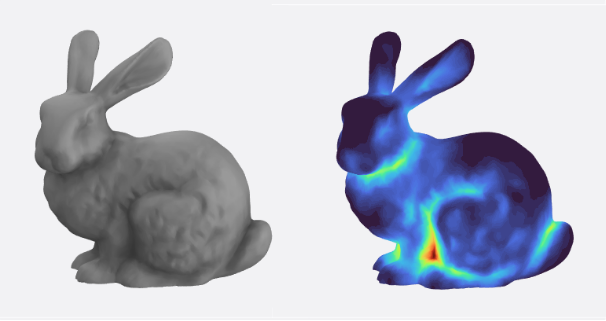

<div align="center">  </div>

# Graphics and Implicit Modeling
[Go back to home page](https://bjcaasenbrood.github.io/SorotokiCode/)

## Rendering
Sorotoki is equipped with a wide range of material rendering options. 

### Material captures
```matlab
%% preview
obj = Gmodel(@(x) dSphere(x,0,0,0,1),[-1,1,-1,1,-1,1]);

%% material list
mat = {aniso, bluered, bump, chroma, chromium, ...
       clean, copper, egg, grey, hotmetal, jade, ...
       matcap, mateplastic, metal, metalclean, ...
       oldwax, orangeresin, planet, plastic, ...
       redshine, redwax, retro, rim, soft, ...
       skin, studioclay};

% loop materials
for ii = 1:length(mat)
  pause(0.1);
  obj.Texture = mat{ii};
  if ii == 1, obj.render;
  else, obj.update();
  end
end
```

<div align="center">  </div>

### Ambient occlusion (AO)
```matlab
%% preview
obj = Gmodel('Bunny.stl');

%% set texture settings
obj.set('Texture',grey,'AO',true,'AOPower',5.0,'AORadius',0.2);
obj.bake().render().update();

%% show AO map 
obj_ = obj.copy('Translate',{'y',100});
obj_.render().showMap('AO');
view(90,15); axis tight;
```
<div align="center">  </div>


### Sub-Surface Scattering (SSS)
```matlab
%% preview
obj = Gmodel('Bunny.stl');

%% set texture settings
obj.set('Texture',grey,'Emission',[0.70 0.70 0.70],...
        'SSS',true,'SSSPower',1.40,'SSSRadius',0.2);
    
obj.bake().render().update();

%% set AO map object
obj_ = obj.copy('Translate',{'y',100});
obj_.render().showMap('SSS');
view(90,15); axis tight;
```
<div align="center">  </div>
