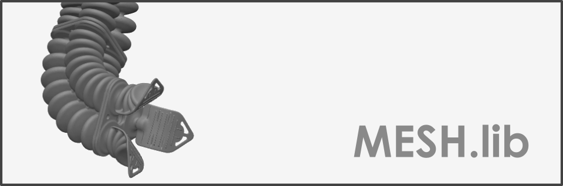

 

  

# Mesh Generation
[**Sorotoki**](https://bjcaasenbrood.github.io/SorotokiCode/) offers mesh generation for triangular, quadrilateral, and polygonal elements. The restricted material domains for the meshes are defined by so-called *signed distance functions* (SDF). The toolkit provides a set of geometeric shape (e.g., circles, rectangles, lines) and boolean operators, e.g., union, difference, and intersect. Together these operation allow for a wide range of meshing domain. 

# Signed distance functions
A signed distance functions (SDF) takes a spatial coordinate and returns the shortest distance to the boundary of a bounded domain $$\Omega$$. Mathematically, the signed distance function $$f: \mathbb{R}^n \mapsto \mathbb{R}$$ of a subset $$\Omega \subset \mathbb{R}^n$$ is defined by

$$
    f(x) := 
\begin{cases}
    d(x,\partial \Omega )   & \text{if } x \in \Omega\\
    -d(x,\partial \Omega ) & \text{if } x \in \mathbb{R}^n \setminus \Omega
\end{cases}
$$

where $$d(x,\partial \Omega)$$ represents the shortest distance to the boundary $$\partial \Omega$$. The sign of the distance function determines if the coordinate is inside or outside the bounded domain. Let us consider a few signed distance functions:

[**Homepage**](https://bjcaasenbrood.github.io/SorotokiCode/)
