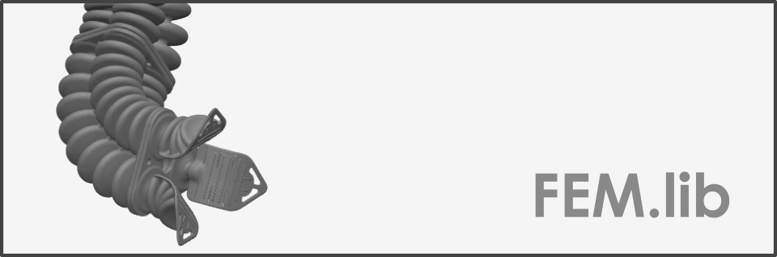

<div align="center">  </div>

# Nonlinear Topology Optimization

[**Homepage**](https://bjcaasenbrood.github.io/SorotokiCode/)

### Example: Pneu-net soft robot

<div align="center">  </div>

```matlab
W = 20;   % width
H = 40;   % height  
E = 1;    % edge 
T = 20;   % thickness

sdf = @(x) PneuNet(x,W,H,E,T);

%% generate mesh
msh = Mesh(sdf);
msh = msh.set('BdBox',[0,W,0,H],...
              'NElem',1e3,...
              'MaxIteration',50,...
              'ShowMeshing',false,...
              'Triangulate',false);
      
msh = msh.generateMesh;

%% show generated mesh
fem = Fem(msh);
fem = fem.set('TimeStep',1/3,...
              'VolumeInfill',0.3,...
              'Penal',4,...
              'VolumetricPressure',true,...
              'FilterRadius',4,...
              'Periodic',[1/2, 0],...
              'Repeat',ones(1,7),...
              'OptimizationProblem','Compliant');

%% add constraint
id = fem.FindNodes('Left'); 
fem = fem.AddConstraint('Support',id,[1,1]);

id = fem.FindNodes('Right'); 
fem = fem.AddConstraint('Output',id,[0,-1]);
fem = fem.AddConstraint('Spring',id,[0,1]);

id = fem.FindElements('Location',[W/2,H/2],1);
fem = fem.AddConstraint('PressureCell',id,[1e-3,0]);

%% set density
fem = fem.initialTopology('Hole',[W/2,H/2],1);

%% material
fem.Material = Dragonskin10A;

%% solving
fem.optimize();

function Dist = PneuNet(P,W,H,E,T)
R1 = dRectangle(P,0,W,0,H);
R2 = dRectangle(P,-W/2,E,T,H+H/2);
R3 = dRectangle(P,W-E,W+W/2,T,H+H/2);
C1 = dCircle(P,0,T + 0.5,1);
C2 = dCircle(P,W,T + 0.5,1);
Dist = dDiff(dDiff(dDiff(dDiff(R1,R2),R3),C1),C2);
end


```

