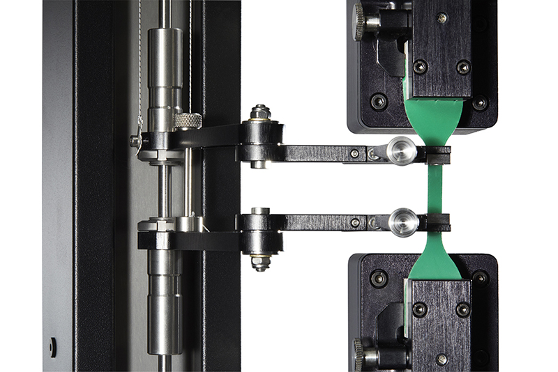

#  Specimen pull-test (Hyper-elastic material)
{: .no_toc }

  

    Table of contents
  

  {: .text-delta }
1. TOC
{:toc}

---

#### Difficulty: `beginner`{: .fs-3 .text-green-200} 
{: .no_toc }
 - Required classes: `Mesh.m`{: .text-purple-000}, `Fem.m`{: .text-purple-000}
 - Code length: `~25 lines`{: .text-purple-000} (without comments)

---

### Introduction
In this illustrative example, we will perform a simple pull test using a hyper-elastic material -- Ecoflex0030 from SmoothOn. Assuming a two-dimensional problem, we consider a 20x20 specimen and perform a 300% uni-axial elongation. We model this using a single quadrilateral finite-element subjected to plane-stress conditions.

  

 Source image is taken from the work of (see [1]) 

[**[1]**](https://www.rubbernews.com/blogs/new-products-james-heal-makes-move-rubber-testing-markets) **Titan10** a pull-test instrument for rubber and elastomers.
{: .fs-3} 

