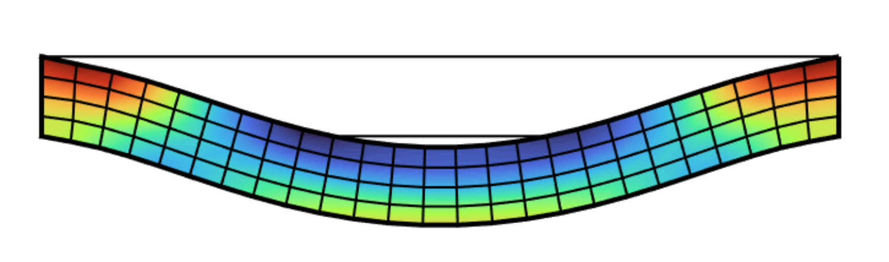
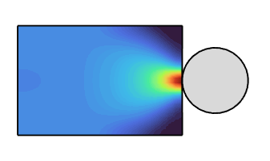
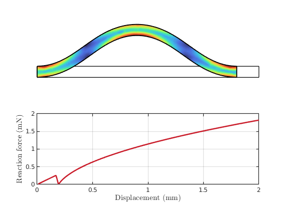

<script src="https://cdn.mathjax.org/mathjax/latest/MathJax.js?config=TeX-AMS-MML_HTMLorMML" type="text/javascript"></script> 

# Finite element method
SOROTOKI includes a finite element solver able to deal with linear and nonlinear problems. The finite element toolkit offers a set of constitutive material models - including Linear, Neo-Hookean, Mooney-Rivlin, and Yeoh -- covering for a wide range of soft materials. It also provides some preset soft material models that are known to be used extensively in soft robotics research. Examples included: Ecoflex-0030, Dragonskin-30A, Elastosil, and NinjaFlex TPU.

Generating the mesh can also be done in SOROTOKI, we refer the reader to [`Mesh`](./meshing.html). 

## List of material models:
```matlab
% different material models
fem.Material = LinearMaterial('E',-,'Nu',-);           
fem.Material = NeoHookeanMaterial('E',-,'Nu',-);     
fem.Material = MooneyMaterial('C10',-,'C01',-,'K',-); 
fem.Material = YeohMaterial('C1',-,'C2',-,'C3',-)  
                            
% different preset materials
fem.Material = Ecoflex0030();
fem.Material = Dragonskin20A();   	 
fem.Material = Elastosil();   	 
fem.Material = TPU90();   	 
```

### Material models operators

| Material   | SOROTOKI     | Material model  |
|:-------------|:------------------|:------|
| Linear   | `LinearMaterial('E',-,'Nu',-)`  | $$\Psi = \lambda I \otimes I + 2\mu I $$ 
| Neo-Hookean   | `NeoHookeanMaterial('E',-,'Nu',-)`  | $$\Psi = C_1(J_1 - 3)$$ 
| Mooney-Rivlin   | `MooneyMaterial('C1',-,'C2',-)`  | $$\Psi = C_{1}({J}_1 - 3) + C_{2}({J}_2 - 3)$$ 
| 3rd-order Yeoh  | `YeohMaterial('C1',-,'C2',-,'C3',-)`  | $$\Psi = \sum_{i=1}^3 C_{i}({J}_1 - 3)^{i}$$ 

# Numerical examples

<div align="center">  </div>

### Example: Double clamped beam 
```matlab
%% generate mesh from sdf
sdf = @(x) dRectangle(x,0,20,0,2);

msh = Mesh(sdf,'BdBox',[0,20,0,2],'Quads',[25 4]);
msh = msh.generate();

%% generate fem model from mesh
fem = Fem(msh,'TimeStep',1/25);

%% add boundary conditions
fem = fem.AddConstraint('Support',fem.FindNodes('Left'),[1,1]);
fem = fem.AddConstraint('Support',fem.FindNodes('Right'),[1,1]);
fem = fem.AddConstraint('Load',fem.FindNodes('Bottom'),[0,-1e-3]);

%% select material
fem.Material =  Dragonskin10;

%% solving
fem.solve();
```

### Example: Tensile bone of silicone elastomer -- Ecoflex-0050
<div align="center">  </div>
```matlab
%% generate mesh from sdf
sdf = @(x) TensileBone(x,10,2,4,1,1);

msh = Mesh(sdf,'BdBox',[0,10,0,10],'NElem',150);
msh = msh.generate();

%% generate fem model from mesh
fem = Fem(msh,'TimeStep',1/100,'PrescribedDisplacement');

%% add boundary conditions
fem = fem.AddConstraint('Load',fem.FindNodes('Top'),[0,9]);
fem = fem.AddConstraint('Support',fem.FindNodes('Left'),[1,0]);
fem = fem.AddConstraint('Support',fem.FindNodes('Bottom'),[0,1]);
fem = fem.AddConstraint('Output',fem.FindNodes('Location',[1,4]),[0,1]);

%% assign material
fem.Material = Ecoflex0030();

%% solving
fem.solve();

%% plotting
fem.show('Svm'); view(90,90);

function D = TensileBone(P,H,W,T,D,R)
dD = 0.5*(W-D);
dT = 0.5*(H-T);

R1 = dRectangle(P,0,W,0,H);
R2 = dRectangle(P,0,dD,dT,dT+T);
R3 = dRectangle(P,W-dD,W,dT,dT+T);
C1 = dCircle(P,dD-R,dT,R);
C2 = dCircle(P,dD-R,dT+T,R);
C3 = dCircle(P,W-dD+R,dT,R);
C4 = dCircle(P,W-dD+R,dT+T,R);
D0 = dDiff(dDiff(dDiff(R1,R2),C1),C2);
D = dDiff(dDiff(dDiff(D0,R3),C3),C4);
end
```

### Example: Contact mechanics with signed distance functions (SDF)
<div align="center">  </div>
```matlab
%% generate mesh from sdf
R = 6;
sdf = @(x) dRectangle(x,-10,10,0,30);

msh = Mesh(sdf,'BdBox',[-10,10,0,30],'Quads',25^2);
msh = msh.generate();

%% generate fem model from mesh
fem = Fem(msh,'TimeStep',1/50,'Linestyle','none');

%% add constraint
fem = fem.AddConstraint('Support',fem.FindNodes('Bottom'),[0,1]);
fem = fem.AddConstraint('Contact',@(x) SDF(x,R),[0,-0.5*R]);

%% assign material
fem.Material = Dragonskin10A;

%% solving
fem.solve();

function Dist = SDF(x,R)
Dist = dCircle(x,0,30+R,R);
end
```

### Example: Three-dimensional beam under torsion
<div align="center">  </div>

```matlab
%% generate mesh from sdf
sdf = @(x) dCube(x,-3,3,-3,3,0,20);
msh = Mesh(sdf,'BdBox',[-3,3,-3,3,0,20],'Hexahedron',[3,3,10]);

msh = msh.generate();
msh = msh.show();

%% generate fem model from mesh
fem = Fem(msh,'Nonlinear',true,'TimeStep',1/100,'PrescribedDisplacement',true,...
    'Movie',true,'MovieAxis',[-5 5 -5 5 0 21]);

%% add constraint
fem = fem.AddConstraint('Support',fem.FindNodes('Bottom'),[1,1,1]);
fem = fem.AddConstraint('Support',fem.FindNodes('Top'),[0,0,1]);
fem = fem.AddConstraint('Load',fem.FindNodes('Top'),so3([0,0,1.25*pi]));

%% select material
fem.Material =  TPU90();

%% solving
fem.solve();
```

### Example: Buckling beam 
<div align="center">  </div>

```matlab
%% generate mesh from sdf
sdf = @(x) dRectangle(x,0,20,0,2);

msh = Mesh(sdf,'BdBox',[0,20,0,2],'NElem',150);
msh = msh.generate();

%% generate fem model from mesh
fem = Fem(msh,'TimeStep',1/200,'PrescribedDisplacement',true);

%% add boundary condition
fem = fem.AddConstraint('Support',fem.FindNodes('Left'),[1,1]);
fem = fem.AddConstraint('Support',fem.FindNodes('SE'),[0,1]);
fem = fem.AddConstraint('Support',fem.FindNodes('NE'),[0,1]);
fem = fem.AddConstraint('Load',fem.FindNodes('Right'),[-4,0]);

%% add logger nodes
fem = fem.AddConstraint('Output',fem.FindNodes('SE'),[0,0]);

%% assign material
fem.Material = Ecoflex0030();

%% solving
fem.solve();

%% plot force-displacement relation
figure(101);
subplot(2,1,1); fem.show('Svm');
subplot(2,1,2); plot(fem.Log{2,3}/1e3,fem.Log{2,6}/1e3,'linewidth',2,'Color',col(2));
xlabel('Displacement (mm)','interpreter','latex','fontsize',12);
ylabel('Reaction force (mN)','interpreter','latex','fontsize',12);
grid on; set(gca,'linewidth',1);
```
