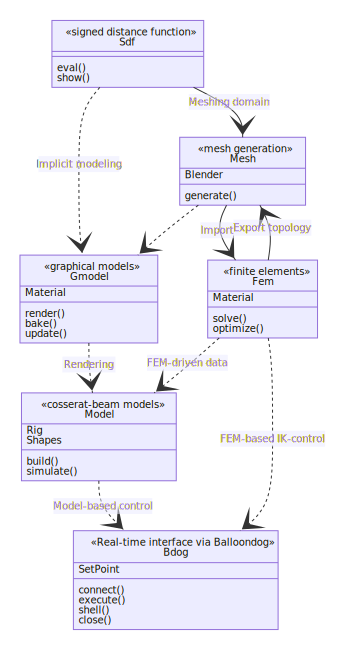

# User guide
{: .no_toc }

<details open markdown="block">
  <summary>
    Table of contents
  </summary>
  {: .text-delta }
1. TOC
{:toc}
</details>


---
# SOROTOKI architecture
The software diagram below shows how each class interact. For instance, **Sdf** can inputted into **Mesh**, and **Mesh** can be used for **Fem**. Then, solving some quasi-static problems, the FEM-driven data can be imported into **Model** -- from which we can develop model-based controllers that can tested using the class **Bdog**.
<div align="center">  </div>

# Useful commands within SOROTOKI

<div class="code-example" markdown="1">
## `sorotoki(arg)`{: .fs-6 .text-purple-000 .text-alpha}
{: .no_toc }
- `Function`{: .text-red-000} -- Calls the SOROTOKI installation manager.
	- `arg`{: .text-blue-000} -- `(empty)`, `'check'`, `'update'`, `'demo'`, `'update'`.

```matlab
# USAGE
sorotoki();	% calls the installer
sorotoki('check');	% performs complete check of toolkit
sorotoki('update');	% updates SOROTOKI to newest version
sorotoki('unload');	% removes toolkit from search path
sorotoki('demo');	% provides a list of demos
```
</div>


<div class="code-example" markdown="1">
## `clr()`{: .fs-6 .text-purple-000 .text-alpha}
{: .no_toc }
- `Function`{: .text-red-000} --  Performs `clc`, `clear all`, and  `close all` in one call.
</div>

<div class="code-example" markdown="1">
## `cdsoro()`{: .fs-6 .text-purple-000 .text-alpha}
{: .no_toc }
- `Function`{: .text-red-000} --  Sets current directory to the installation folder of SOROTOKI.
</div>

<div class="code-example" markdown="1">
## `add2path()`{: .fs-6 .text-purple-000 .text-alpha}
{: .no_toc }
- `Function`{: .text-red-000} --  Adds current directory to MATLAB's search path.
</div>

<div class="code-example" markdown="1">
## `unload_sorotoki`{: .fs-6 .text-purple-000 .text-alpha}
{: .no_toc }
- `Function`{: .text-red-000} --  Removes the entire SOROTOKI toolkit from MATLAB's search path. **NOTICE:** This does not uninstall SOROTOKI, it prevents MATLAB from finding all functions tied to the toolkit. If MATLAB restarts, the `startup.m` will load SOROTOKI normally.
</div>


---

# Signed Distance Functions  -- `Sdf.m`{: .text-purple-000}

<div class="code-example" markdown="1">
## `sdf = Sdf(fnc)`{: .fs-6 .text-purple-000 .text-alpha}
{: .no_toc }
- `Class::Sdf`{: .text-red-000} --  Creates a Signed Distance Function Class from the input function `fnc = @(x) ....`
	- `fnc`{: .text-blue-000} -- `Function::f = @(x) ...`{: .text-red-000} such that `d = f([Nx2 Matrix])` or `d = f([Nx3 Matrix])` gives the output `d = [Nx1 Column]` of signed distances (negative implies inside the domain). The simplest example is `sdf = @(x) sqrt((x(:,1)).^2 + (x(:,2)).^2) - 1.0` which results in a unit-circle about the origin (0,0).

- `Public variables`{: .text-red-000}
	- `sdf`{: .text-blue-000} -- `Function::sdf = @(x) ...`{: .text-red-000},
	- `BdBox`{: .text-blue-000} -- `[1x4 Row]`, `[1x6 Row]`,
	- `cmap`{: .text-blue-000} -- `viridis` (default), or `[Nx3 ColorMatrix]`.

```matlab
# USAGE
fnc = @(x) sqrt((x(:,1)).^2 + (x(:,2)).^2) - 1.0;
sdf = Sdf(fnc,'BdBox',[-1,1,-1,1]);
```
</div>

<div class="code-example" markdown="1">
## `Sdf = Sdf1 + Sdf2 + ... + Sdfn`{: .fs-6 .text-purple-000 .text-alpha}
{: .no_toc }
- `Class operator`{: .text-red-000} --  Unions two or more Sdf classes.
	- `Sdf1,Sdf2,...`{: .text-blue-000} -- `Class::Sdf`{: .text-red-000}
	- `Sdf`{: .text-blue-000} -- `Class::Sdf`{: .text-red-000}
</div>

<div class="code-example" markdown="1">
## `Sdf = Sdf1 - Sdf2 - ... - Sdfn`{: .fs-6 .text-purple-000 .text-alpha}
{: .no_toc }
- `Class operator`{: .text-red-000} --  Difference between two or more Sdf classes. `Sdf1` is the base function on which the operation is performed.
	- `Sdf1,Sdf2,...`{: .text-blue-000} -- `Class::Sdf`{: .text-red-000}
	- `Sdf`{: .text-blue-000} -- `Class::Sdf`{: .text-red-000}
</div>

<div class="code-example" markdown="1">
## `Sdf = Sdf1/Sdf2`{: .fs-6 .text-purple-000 .text-alpha}
{: .no_toc }
- `Class operator`{: .text-red-000} --  Intersection between two Sdf classes. `Sdf1` is the base function on which the operation is performed.
	- `Sdf1,Sdf2`{: .text-blue-000} -- `Class::Sdf`{: .text-red-000}
	- `Output`{: .text-blue-000} -- `Class::Sdf`{: .text-red-000}
</div>

<div class="code-example" markdown="1">
## `Sdf.show()`{: .fs-6 .text-purple-000 .text-alpha}
{: .no_toc }
- `Public function`{: .text-red-000} --  Creates `figure(101)` or uses existing `figure(101)` to show the Signed Distance Field within the domain `Sdf.BdBox`. The colormap is `viridis` by default.
</div>

### Two-dimensional presets
<div class="code-example" markdown="1">
## `sdf = sCircle(x0,y0,R)`{: .fs-6 .text-purple-000 .text-alpha}
{: .no_toc }
- `Class::Sdf`{: .text-red-000} --  Creates a circular signed distance function
	- `x0`{: .text-blue-000},`y0`{: .text-blue-000} -- `[float]`; X and Y coordinate of the origin.
	- `R`{: .text-blue-000} -- `[float]`; radius of the circle.
</div>

<div class="code-example" markdown="1">
## `sdf = sRectangle(x1,x2,y1,y2)`{: .fs-6 .text-purple-000 .text-alpha}
{: .no_toc }
- `Class::Sdf`{: .text-red-000} --  Creates a circular signed distance function
	- `x1`{: .text-blue-000},`y1`{: .text-blue-000} -- `[float]`; X and Y coordinate of left-bottom corner of the rectangle.
	- `x2`{: .text-blue-000},`y2`{: .text-blue-000} -- `[float]`; X and Y coordinate of right-top corner of the rectangle.
</div>

### Three-dimensional presets
<div class="code-example" markdown="1">
## `sdf = sSphere(x0,y0,z0,R)`{: .fs-6 .text-purple-000 .text-alpha}
{: .no_toc }
- `Class::Sdf`{: .text-red-000} --  Creates a circular signed distance function
	- `x0`{: .text-blue-000},`y0`{: .text-blue-000},`z0`{: .text-blue-000} -- `[float]`; X,Y, and Z coordinate of the origin.
	- `R`{: .text-blue-000} -- `[float]`; radius of the sphere.
</div>

<div class="code-example" markdown="1">
## `sdf = sCube(x1,x2,y1,y2)`{: .fs-6 .text-purple-000 .text-alpha}
{: .no_toc }
- `Class::Sdf`{: .text-red-000} --  Creates a circular signed distance function
	- `x1`{: .text-blue-000},`y1`{: .text-blue-000} -- `[float]`; X and Y coordinate of left-bottom corner of the rectangle.
	- `x2`{: .text-blue-000},`y2`{: .text-blue-000} -- `[float]`; X and Y coordinate of right-top corner of the rectangle.
</div>


---

# Mesh generation -- `Mesh.m`{: .text-purple-000}

<div class="code-example" markdown="1">
## `msh = Mesh(sdf)`{: .fs-6 .text-purple-000 .text-alpha}
{: .no_toc }
- `Constructor::Sdf`{: .text-red-000} --  Creates a Signed Distance Function Class from the input `fnc = @(x) ....`
	- `msh`{: .text-blue-000} -- `Class::Mesh = @(x) ...`{: .text-red-000} such that `d = f([Nx2 Matrix])` or `d = f([Nx3 Matrix])` gives the output `d = [Nx1 Column]` of signed distances (negative implies inside the domain). The simplest example is `sdf = @(x) sqrt((x(:,1)).^2 + (x(:,2)).^2) - 1.0` which results in a unit-circle about the origin (0,0).

## `msh = Mesh(node,element)`{: .fs-6 .text-purple-000 .text-alpha}
{: .no_toc }
- `Constructor::Mesh`{: .text-red-000} --  Creates a Signed Distance Function Class from the input function `fnc = @(x) ....`
	- `sdf`{: .text-blue-000} -- `Class::sdf = @(x) ...`{: .text-red-000}.

## `msh = Mesh(image,box,hmax)`{: .fs-6 .text-purple-000 .text-alpha}
{: .no_toc }
- `Constructor::Sdf`{: .text-red-000} --  Creates a Signed Distance Function Class from the input function `fnc = @(x) ....`
	- `sdf`{: .text-blue-000} -- `Class::sdf = @(x) ...`{: .text-red-000}.		

### Public variables
{: .fs-4 .text-purple-000 .text-alpha}
- `sdf`{: .text-blue-000} -- `Function::sdf = @(x) ...`{: .text-red-000},
- `BdBox`{: .text-blue-000} -- `[1x4 Row]`, `[1x6 Row]`,
- `cmap`{: .text-blue-000} -- `viridis` (default), or `[Nx3 ColorMatrix]`.

```matlab
# USAGE
fnc = @(x) sqrt((x(:,1)).^2 + (x(:,2)).^2) - 1.0;
sdf = Sdf(fnc,'BdBox',[-1,1,-1,1]);
```
</div>

---

# Finite element method -- `Fem.m`{: .text-purple-000}

<div class="code-example" markdown="1">
## `fem = Fem(msh)`{: .fs-6 .text-purple-000 .text-alpha}
{: .no_toc }
- `Constructor::Fem`{: .text-red-000} --  Creates a Signed Distance Function Class from the input function `fnc = @(x) ....`
	- `msh`{: .text-blue-000} -- `Class::Mesh = @(x) ...`{: .text-red-000} such that `d = f([Nx2 Matrix])` or `d = f([Nx3 Matrix])` gives the output `d = [Nx1 Column]` of signed distances (negative implies inside the domain). The simplest example is `sdf = @(x) sqrt((x(:,1)).^2 + (x(:,2)).^2) - 1.0` which results in a unit-circle about the origin (0,0).

</div>

### Node/Edge selection

### Hyper-elastic material presets

---


# Dynamic Modeling -- `Model.m`{: .text-purple-000}

bla

---


# Graphical models -- `Gmodel.m`{: .text-purple-000}

### Graphical material presets


---


# IK-rigging -- `Rig.m`{: .text-purple-000}

bla

---

# Plotting tools
<div class="code-example" markdown="1">
## `X = col(k, varargin)`{: .fs-6 .text-purple-000 .text-alpha}
{: .no_toc }
- `Function`{: .text-red-000} --  Returns `X = [3x1 ColorRow]` given the index `k`.
	- `k`{: .text-blue-000} -- `[integer]` ranging from `1` to `12`.
	- `varargin`{: .text-blue-000} -- `[float]` over-expose parameter ranging from `0` to `1`, default is `0`.
</div>

<div class="code-example" markdown="1">
## `background(color)`{: .fs-6 .text-purple-000 .text-alpha}
{: .no_toc }
- `Function`{: .text-red-000} --  Sets figures background color
	- `color`{: .text-blue-000} -- `'w'`, `'b'`, `gitpage`, `metropolis`
</div>


---


---
