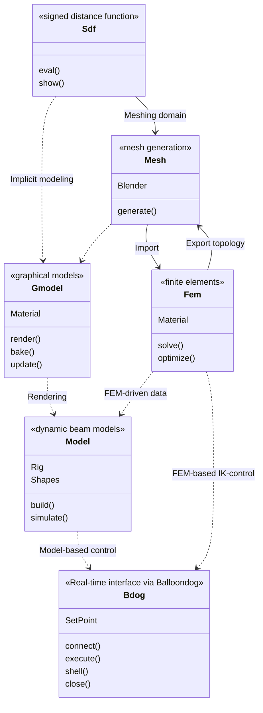

# About

SOROTOKI is an open-source MATLAB toolkit for soft robotics that includes an array of tools for design, modeling, and control. Due to its scientific diversity, it can be challenging for researchers to quickly familiarize themselves with multiple scientific disciplines. With the aim to lower the threshold, Sorotoki aims to incorporate multiple layers of soft robotics research into one toolkit. Examples include: continuum mechanics, dynamic systems and control theory, topology optimization, computer graphics, and much more to come! The combination provides a highly flexible modeling environment and hopefully aids the development of novel soft robotic research.

# Object-oriented architecture
bla

