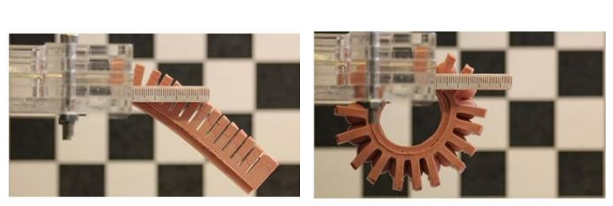
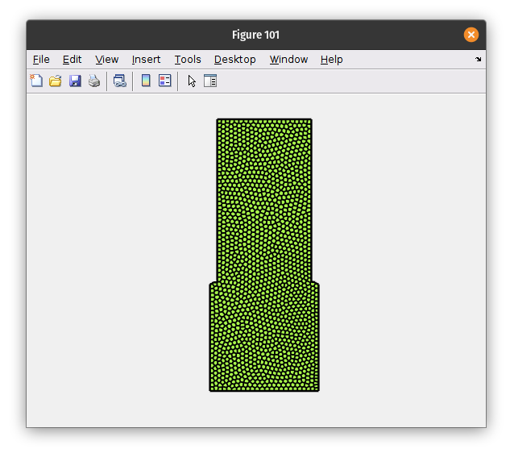

#  Topology optimization of PneuNet actuator
{: .no_toc }

<details open markdown="block">
  <summary>
    Table of contents
  </summary>
  {: .text-delta }
1. TOC
{:toc}
</details>

---

#### Difficulty: `intermediate`{: .fs-3 .text-green-200}
{: .no_toc }
 - Required classes: `Sdf.m`{: .text-purple-000}, `Mesh.m`{: .text-purple-000}, `Fem.m`{: .text-purple-000}
 - Code length: `~25 lines`{: .text-purple-000} (without comments)

---

### Introduction
In this illustrative example, we will exploit topology optimization to find a sub-optimal soft structure that undergoes a bending motion when pressurized. This morphology is often associated with a popular class of soft robots named ‘PneuNet’ actuators [1]. PneuNet actuators consist of a set of rectangular pneumatic chambers inside an elastomer medium. When pressurized, these chambers inflate, and due to a stiffness differential the elastomer structure bends (see figure below). To model and optimize such a hyper-elastic structure, we use mainly use the functionality within the `Fem.m`{: .text-purple-000} class of SOROTOKI. The classes `Sdf.m`{: .text-purple-000} and `Mesh.m`{: .text-purple-000} are used to shape the rectangular domain of a single pressure chamber.

<div align="center">  </div>
<div align="center"> Source image is taken from the work of (see [1]) </div>

<div align="center">  </div>
<div align="center"> Topology optimization process of a PneuNet using SOROTOKI (see [2])
 </div>

### Generating the mesh

Lets start with designing the material domain of the PneuNet actuator. To do so, we start with the classes `Sdf.m`{: .text-purple-000} and `Mesh.m`{: .text-purple-000}. Since PneuNet actuators have a periodical structure, it is sufficient to model a single pressure chamber of the PneuNet for this particular example.


```matlab
%% Domain parameters
W = 30;  % width cell
H = 75;  % width cell
D = 2;   % inter distance

%% Signed Distance Function (SDF)
sdf = @(x) PneuNet(x,W,H,D,W);

%% SDF construction
function Dist = PneuNet(P,W,H,E,T)
  R1 = dRectangle(P,0,W,0,H);
  R2 = dRectangle(P,-W/2,E,T,H+H/2);
  R3 = dRectangle(P,W-E,W+W/2,T,H+H/2);
  C1 = dCircle(P,0,T + 0.5,1);
  C2 = dCircle(P,W,T + 0.5,1);
  Dist = dDiff(dDiff(dDiff(dDiff(R1,R2),R3),C1),C2);
end
```

Then, we wish to generate a discretized mesh based on the signed distance function `sdf`{: .text-purple-000}. To do so, we simply input the signed distance function into `msh = Mesh(sdf)`{: .text-purple-000}; together with the **bounding box** (`BdBox = [0,W,0,H]`{: .text-purple-000}) and the required **number of finite-elements** (`NElem = 1250`{: .text-purple-000}). Notice that we can use the previously defined width and height to outline this bounding box. Finally, we call the public function `msh.generate()`{: .text-purple-000} to build the mesh.

```matlab
%% generate mesh
msh = Mesh(sdf,'BdBox',[0,W,0,H],'NElem',1250);
msh = msh.generate();
msh.show();
```
In SOROTOKI, figures can be produced through a `show()`{: .text-purple-000} request of the class. The figure will automatically be called `figure(101)` if no figures are opened. The polygonal mesh of the PneuNet domain is shown below.

<div align="center">  </div>
<div align="center"> Polygonal mesh of single PneuNet chamber.</div>

---
### Building the finite element model
We can now convert this polygonal mesh to a two-dimensional finite element model in a few steps. First, we input the `msh`{: .text-purple-000} object generated by the class `Mesh.m`{: .text-purple-000} into `Fem.m`{: .text-purple-000}. Secondly, we specify some important setting for the finite element solver and the optimization algorithm. We'll worry about loads and material settings later on.

```matlab
%% generate fem model
fem = Fem(msh);
fem = fem.set('OptimizationProblem','Compliant');
fem = fem.set('VolumeInfill',0.4);
fem = fem.set('FilterRadius',H/15);
fem = fem.set('Penal',4);
fem = fem.set('Nonlinear',false);
fem = fem.set('MaxIterationMMA',50);
fem = fem.set('ChangeMax',0.05)
```
Alternatively, we can rewrite the code above more compactly.

```matlab
%% generate fem model
fem = Fem(msh,'OptimizationProblem','Compliant','VolumeInfill',0.4,'FilterRadius',H/15,...
  'Penal',4,'Nonlinear',false,'MaxIterationMMA',50,'ChangeMax',0.05);
```
Lets discuss these settings in more detail: The setting `OptimizationProblem`{: .text-purple-000} sets the optimization objective to a compliant problem (default is `'Compliance'`{: .text-purple-000}); `VolumeInfill`{: .text-purple-000} sets the desired volume infill (default is set to `0.3`{: .text-purple-000}); `FilterRadius`{: .text-purple-000} the radius of the spatial filter needed for spatial regularization; `Penal`{: .text-purple-000} penalty power-factor for low-density regions; `Nonlinear`{: .text-purple-000} turns on/off the geometrical and material nonlinearities (default is set to `true`{: .text-purple-000}, i.e.,  active by default); `MaxIterationMMA`{: .text-purple-000} maximum number of optimization steps; and `ChangeMax`{: .text-purple-000} the maximum allowable change in material densities during optimization.

**Important!** It shall be clear that `Nonlinear = true`{: .text-purple-000} will significantly increase the numerical solver time, please check if your system can handle the computational loads during optimization. If not, please use lower-order meshes or have nonlinear deformation turned off.

---

### Introduce periodicity and repetition
In this section, we repeat the material domain 8 times along the horizontal plane to construct a full PneuNet. Furthermore, we add a (periodic) symmetry, which will ensure that a pressure chamber has an appropriate topology that seals. To do so, we can run the code below.

```matlab
%% set spatial settings
fem = fem.set('Periodic',[0.5, 0],'Repeat',ones(8,1));
```

### Boundary conditions (static)

```matlab
%% add boundary condition
id = fem.FindNodes('Left');
fem = fem.AddConstraint('Support',id,[1,1]);

id = fem.FindNodes('Right');
fem = fem.AddConstraint('Spring',id,[0,1]);
fem = fem.AddConstraint('Output',id,[0,-1]);
```
### Loading conditions (dynamic)


### Material assignment

```matlab
%% assign material
fem.Material =  Dragonskin10();
```

### Starting the optimization!

<div align="center">  </div>

## Complete code (27 lines without comments)


```matlab
%% generate mesh from sdf
sdf = @(x) PneuNet(x,20,40,1,20);

msh = Mesh(sdf,'BdBox',[0,20,0,40],'Quads',[25 50]);
msh = msh.generate();

%% generate fem from mesh
fem = Fem(msh,'VolumeInfill',0.3,'Penal',4,'FilterRadius',4,...
              'Nonlinear',false,'TimeStep',1/3,...
              'OptimizationProblem','Compliant',...
              'MaxIterationMMA',70);

%% set spatial settings
fem = fem.set('Periodic',[0.5, 0],'Repeat',ones(8,1));

%% add boundary condition
id = fem.FindNodes('Left');
fem = fem.AddConstraint('Support',id,[1,1]);

id = fem.FindNodes('Right');
fem = fem.AddConstraint('Spring',id,[0,1]);
fem = fem.AddConstraint('Output',id,[0,-1]);

id = fem.FindElements('Location',[10,25],1);
fem = fem.AddConstraint('PressureCell',id,[1e-3,0]);

%% set density
fem = fem.initialTopology('Hole',[10,25],0.5);

%% material
fem.Material = Dragonskin10;

%% solving
fem.optimize();
fem.show('ISO');

function Dist = PneuNet(P,W,H,E,T)
R1 = dRectangle(P,0,W,0,H);
R2 = dRectangle(P,-W/2,E,T,H+H/2);
R3 = dRectangle(P,W-E,W+W/2,T,H+H/2);
C1 = dCircle(P,0,T + 0.5,1);
C2 = dCircle(P,W,T + 0.5,1);
Dist = dDiff(dDiff(dDiff(dDiff(R1,R2),R3),C1),C2);
end
```

[**[1]**](https://ieeexplore.ieee.org/abstract/document/9116010/metrics#metrics) B. Caasenbrood, A. Pogromsky and H. Nijmeijer, **A Computational Design Framework for Pressure-driven Soft Robots through Nonlinear Topology Optimization**, 2020 3rd IEEE Inter. Conf. on Soft Robotics (RoboSoft), pp. 633-638, 2020. [ 10.1109/RoboSoft48309.2020.9116010](https://doi.org/10.1109/RoboSoft48309.2020.9116010)
{: .fs-3}
