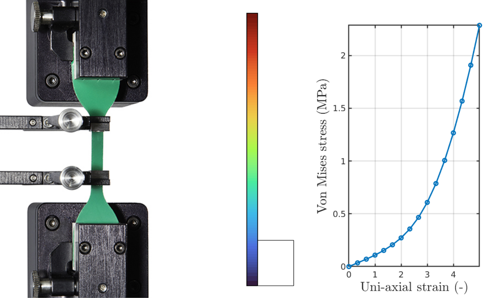
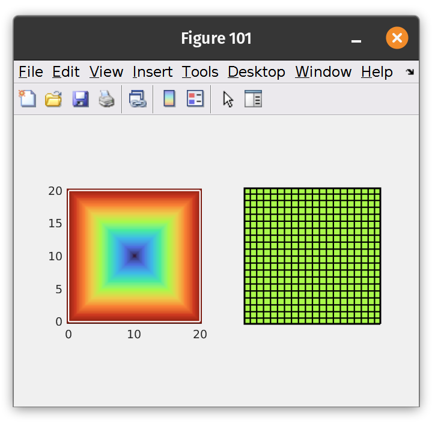
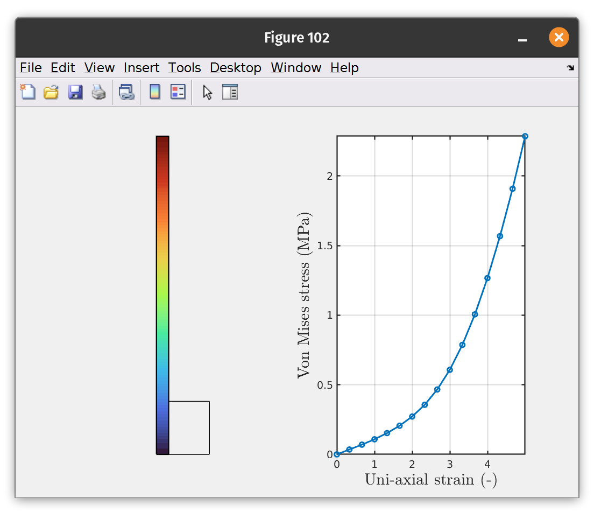

<script type="text/javascript" charset="utf-8"
src="https://cdn.mathjax.org/mathjax/latest/MathJax.js?config=TeX-AMS-MML_HTMLorMML,
https://vincenttam.github.io/javascripts/MathJaxLocal.js"></script>


#  Example 1: Hyper-elastic material fit
{: .no_toc }

<details open markdown="block">
  <summary>
    Table of contents
  </summary>
  {: .text-delta }
1. TOC
{:toc}
</details>
---

#### Difficulty: `intermediate`{: .fs-3 .text-green-200}
{: .no_toc }
- Required classes: `Mesh.m`{: .text-purple-000}, `Fem.m`{: .text-purple-000}
- Code length: `~25 lines`{: .text-purple-000} (without comments)

---

### Introduction
In this illustrative example, we will perform a tension test to fit a hyper-elastic material model for some unknown elastic material. A collection of these measurements have been performed and are saved in under `.\script\tutorial\T1_materialfit.mat`{: .text-purple-000}. Assuming a two-dimensional problem, we consider a $20 \times 20$ mm material specimen and numerically simulate a uni-axial elongation of $\lambda_1 = 500 \%$. Using SOROTOKI, we can run the simulated model through an **constrained optimization routine** (`fmincon.m`) to find the unknown material coefficients for a the Yeoh model:

$$\Psi = \sum^3_{i = 1} c_i \left(J_1 - 1 \right)^{i},$$

where $J_1$ denotes the first strain invariant of the Lagrangian strain tensor. The results of the material fit are shown below.

<div align="center">  </div>
<div align="center"> Stock image of uni-axial test (left). Produced result from SOROTOKI (right). </div>

### Generating the mesh through SDFs
Lets start generating a planar rectangular mesh. To discretize the material domain, we use the Signed Distance Function (SDF) Class and Meshing Class -- `Sdf.m`{: .text-purple-000} and `Mesh.m`{: .text-purple-000}, respectively. We can define the rectangular domain using SDFs and convert it to a quadtrilateral mesh, consider the following code:

```matlab
%% simulation settings
H  = 20;       % height of specimen
W  = 20;       % width of specimen
dL = H*6;      % elongation of specimen

%% signed distance function (SDF)
sdf = sRectangle(W,H);

%% generate mesh
msh = Mesh(sdf,'Quads',[20,20]);
msh = msh.generate();

%% show SDF and mesh
subplot(1,2,1); sdf.show();
subplot(1,2,2); msh.show();
```

The code above should produce the following:

<div align="center">  </div>
<div align="center"> Signed Distance Function (left). Quad mesh of 400 elements (right). </div>

### Building the finite element model
We can now convert this discretized mesh to a finite element model in a few steps. First, we input the `msh`{: .text-purple-000} object generated by the class `Mesh.m`{: .text-purple-000} into `Fem.m`{: .text-purple-000}. Secondly, we specify some important setting for the finite element solver:

```matlab
%% convert Mesh to Fem
fem = Fem(msh);

%% setting for fem model
fem.set('TimeStep',1/25);
fem.set('PrescribedDisplacement',true);
fem.set('Linestyle','none');
fem.set('Coloraxis',[0,1]);
```
Alternatively, we can rewrite the code above more compactly.

```matlab
%% generate fem model
fem = Fem(msh,'TimeStep',1/25,'PrescribedDisplacement',true,...
'Linestyle','none','Coloraxis',[0,1]);
```

Lets discuss these settings in more detail: The setting `TimeStep`{: .text-purple-000} sets the time increments for the nonlinear solver; `PrescribedDisplacement`{: .text-purple-000} sets the mechanical problem as a prescribed displacements instead of applied loads (default is set to `false`{: .text-purple-000}); `Linestyle`{: .text-purple-000} sets the linestyle of the plots; `Coloraxis`{: .text-purple-000} sets the color axis for the colormaps. The default colormap is `turbo`{: .text-purple-000} (a custom colormap from SOROTOKI -- adapted from python).

### Assigning boundary conditions
Given the symmetry of the problem, we can fixate the $x$-displacement for the left face of the material domain and fixate the $y$-displacement for the bottom face. We can use the function `fem.AddConstraint`{: .text-purple-000} with the input `Support`{: .text-purple-000}. To find the associated nodal indices of the model `fem`{: .text-purple-000}, we can use the public function `fem.FindNodes`{: .text-purple-000} together with a specified argument of their location, e.g., `Top`{: .text-purple-000}, `Bottom`{: .text-purple-000}, `Left`{: .text-purple-000}, `Right`{: .text-purple-000}. Similarly, the applied displacement `dL`{: .text-purple-000} is added using the `fem.AddConstraint`{: .text-purple-000} function with the input `Load`{: .text-purple-000}. The code for these procedures is given below:

```matlab
%% adding boundary condition
id = fem.FindNodes('Left');
fem = fem.AddConstraint('Support',id,[1,0]);

id = fem.FindNodes('Bottom');
fem = fem.AddConstraint('Support',id,[0,1]);

id = fem.FindNodes('Top');
fem = fem.AddConstraint('Load',id,[0,dL]);
```

### Output logging
To record the intermediate nodal data during the numerical solver, we can add a logger. To do so, we again use the `fem.AddConstraint`{: .text-purple-000} but with `Output`{: .text-purple-000} as its input argument.
```matlab
%% outputs nodal data in fem.Log
fem = fem.AddConstraint('Output',fem.FindNodes('NW'));
```
Here `fem.FindNodes('NW')`{: .text-purple-000} finds the single node in the North-West corner.

After the finite element problem is solved, the data is recorded in a struct which can be accessed through `fem.Log`{: .text-purple-000}. This structured data contains the solver time `Log.t`{: .text-purple-000}, relative displacement w.r.t. the undeformed configuration `Log.Ux`{: .text-purple-000}, `Log.Uy`{: .text-purple-000}, `Log.Un`{: .text-purple-000}, the stresses `Log.Sxx`{: .text-purple-000}, `Log.Syy`{: .text-purple-000}, `Log.Sxy`{: .text-purple-000} and the Von Mises stress `Log.Svm`{: .text-purple-000}. Additionally, `Log.Psi`{: .text-purple-000} given the total strain energy $\Psi(\cdot)$ of the continuum solid over the finite time horizon.

### Specifying a hyper-elastic ansatz
SOROTOKI comes equipped with a library of preset hyper-elastic materials ([list of preset materials](https://bjcaasenbrood.github.io/SorotokiCode/docs/documentation/guide.html#hyper-elastic-material-presets)). Examples include: Ecoflex-0030/50, Dragonskin 10A/30A, Elastosil, and NinjaFlex. To add the Ecoflex-0030 material properties to the FEM model, simply run:
```matlab
%% adding material properties
fem.Material = Ecoflex0030;
```

### Solving the nonlinear elastic problem
To solve the FEM problem, simply run:
```matlab
%% solving
fem = fem.solve();
```
Solving this nonlinear problem might take a few minutes. During the solving routine, plots are generated to display the intermediate displacements; and the error residuals are shown in MATLAB's command window. To stop the solver, simply press `Ctrl + C`{: .text-purple-000} in the command window.

### Post-processing the data
Last, but definitely not least, is post processing the numerical data. Recall that all intermediate nodal data is stored in `fem.Log`{: .text-purple-000}. Let us plot the deformed material domain, along with the Von Mises stress as a function of the elongation strain. To do so, consider the code below:

```matlab
%% post-processing data and plotting
Eyy = (dL/H)*fem.Log.t + 1;
Syy = fem.Log.Svm;

% compute the exact solution
Eyy_exact = linspace(1,1+(dL/H),500);
Syy_exact = @(x) 2*(x.^2 - 1./x).*fem.Material.dWdI(x.^2 + 2./x);

figure(102);
subplot(1,2,1); fem.show('Uy');
subplot(1,2,2); plot(Eyy,Syy,'o-','Color',col(1),'linewidth',2);
subplot(1,2,2); hold on; plot(Eyy_exact,Syy_exact(Eyy_exact),...
    '--','Color',col(1),'linewidth',2);

xlabel('Uni-axial strain (-)','interpreter','latex','fontsize',20);
ylabel('Von Mises stress (MPa)','interpreter','latex','fontsize',20);
legend('FEM','Exact','Location','Northwest','fontsize',18);
grid on; axis tight;
```
The code above should produce the following:

<div align="center">  </div>
<div align="center"> Uni-axial test of Ecoflex-0030 specimen (left). Strain vs. Von Mises (right). </div>

## Complete code (25 lines without comments)

```matlab
%% simulation settings
H  = 20;       % height of specimen
W  = 20;       % width of specimen
dL = H*5;      % elongation of specimen

%% signed distance function (SDF)
sdf = sRectangle(0,W,0,H);

%% generate mesh
msh = Mesh(sdf,'Quads',[20,20]);
msh = msh.generate();

%% show SDF and mesh
figure(101);
subplot(1,2,1); sdf.show();
subplot(1,2,2); msh.show();

%% generate fem model
fem = Fem(msh,'TimeStep',1/15,'PrescribedDisplacement',true,...
'Linestyle','none');

%% adding boundary condition
fem = fem.AddConstraint('Support',fem.FindNodes('Left'),[1,0]);
fem = fem.AddConstraint('Support',fem.FindNodes('Bottom'),[0,1]);
fem = fem.AddConstraint('Load',fem.FindNodes('Top'),[0,dL]);

%% outputs nodal data in fem.Log
fem = fem.AddConstraint('Output',fem.FindNodes('NW'),[0,0]);

%% adding material
fem.Material = Ecoflex0030;

%% solving
fem = fem.solve();

%% post-processing data and plotting
Exx = (dL/H)*fem.Log.t;
Svm = fem.Log.Svm;

figure(102);
subplot(1,2,1); fem.show('Uy');
subplot(1,2,2); plot(Exx,Svm,'-o','linewidth',2)
xlabel('Uni-axial strain (-)','interpreter','latex','fontsize',20);
ylabel('Von Mises stress (MPa)','interpreter','latex','fontsize',20);
set(gca,'linewidth',1.5); grid on; axis tight;
```

[**[1]**](https://www.rubbernews.com/blogs/new-products-james-heal-makes-move-rubber-testing-markets) **Titan10** a pull-test instrument for rubber and elastomers.
{: .fs-3}
