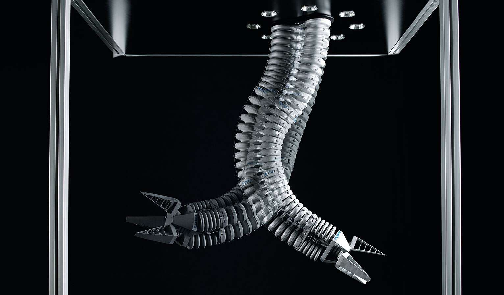

#  Simulating the dynamics of a multi-link soft robot manipulator (PCC approach)
{: .no_toc }

<details open markdown="block">
  <summary>
    Table of contents
  </summary>
  {: .text-delta }
1. TOC
{:toc}
</details>
---

#### Difficulty: `easy`{: .fs-3 .text-green-200} ~ `intermediate`{: .fs-3 .text-green-200}
{: .no_toc }
 - Required classes: `Model.m`{: .text-purple-000}
 - Code length: `~25 lines`{: .text-purple-000} (without comments)

---

### Introduction
In this illustrative example, we will perform a simple pull test using a hyper-elastic material -- Ecoflex-0030 from SmoothOn. Assuming a two-dimensional problem, we consider a 20x20 specimen and perform an uni-axial elongation of $\lambda_{1} = 500\%$ (with $\lambda_2 = \lambda_3$). We model this using a single quadrilateral finite-element subjected to plane-stress conditions.

<div align="center">  </div>
<div align="center"> Festo's Bionic Handling Assistant inspired by the elphant's trunk (see [1]). </div>

### Generating the mesh from pictures
Lets start generating a planar rectangular mesh. To discretize the material domain, we use the Signed Distance Function (SDF) Class and Meshing Class -- `Sdf.m`{: .text-purple-000} and `Mesh.m`{: .text-purple-000}, respectively. We can define the rectangular domain using SDFs and convert it to a quadtrilateral mesh, consider the following code:

```matlab
%% mesh generation settings
Simp  = 0.02;
GrowH = 1;
MinH  = 2;
MaxH  = 3;

%% generate mesh from .png
msh = Mesh('Pneunet.png','BdBox',[0,120,0,20],'SimplifyTol',Simp,...
    'Hmesh',[GrowH,MinH,MaxH]);

msh = msh.generate();

figure(101);
subplot(2,1,1); imshow('Pneunet.png');
subplot(2,1,2); msh.show();
```

The code above should produce the following:

<div align="center">  </div> 
<div align="center"> Source image of Pneunet cross-section (top). Triangular mesh (right). </div>


[**[1]**](https://www.festo.com/group/en/cms/10241.htm) **Bionic Handling Assistant** a soft robotic manipulator from Festo.
{: .fs-3} 

