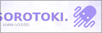

# Sorotoki - a MATLAB toolkit for soft robotics
 
<!-- <div align="center">  </div> <br/> -->
<div align="center">  <br/>
</div> 

[Sorotoki v3.0.01 stable (Code)](#){ .md-button .md-button--secondary .center}
[Sorobots v1.0 (Soft robot STL)](#){ .md-button .md-button--secondary .center}
[:fontawesome-brands-discord:](https://discord.gg/tXtSMZPM){ .md-button .md-button--secondary .center}

## About Sorotoki
Sorotoki is an open-source MATLAB toolkit for soft robotics that includes an array of tools for design, modeling, and control. Due to its scientific diversity, it can be challenging for new researchers to quickly familiarize themselves with multiple scientific areas. With the aim to lower this threshold, Sorotoki aims to incorporate multiple layers of soft robotics research into one compact toolkit. Examples include: continuum mechanics, dynamic systems and control theory, topology optimization, computer graphics, and much more to come! The combination provides a highly flexible programming environment and will hopefully aid the development of novel soft robotic research.

## What can Sorotoki do?
Sorotoki started out small, but at its current state, it contains a vast collection of functionalities -- tailored towards many aspects of soft robotics. Suppose, for example, you are inspired by the multi-gait soft crawler developed by Shepard et al.[^1] -- <a href="https://www.youtube.com/watch?v=lUyuBOtsDu4">see video</a>. Can we model such a system easily? Well.... Short answer: **no**. As matter of fact, simplifying the (infinite-dimensional) dynamics of soft robots is no easy feat. It has been an active topic of research for the better part of the last two decades.

<video width="800" height="310" autoplay controls loop>
<source src="./assets/fem_crawler.mp4" type="video/mp4">
</video>

<figcaption>Simulation of multi-gait crawling soft robot undergoing an undulating motion. The model is inspired by the work of Shepard et al. (2011). Original soft robot can be found here:
<a href="https://www.youtube.com/watch?v=lUyuBOtsDu4">Youtube video</a>
</figcaption>

<div align = "center">
<video width="300" height="110" autoplay controls loop>
<source src="./assets/mdl_suzumori_beaker.ogv" type="video/ogg">
</video>
<video width="225" height="110" autoplay controls loop>
<source src="./assets/mdl_suzumori_screw.ogv" type="video/ogg">
</video>
</div>

<figcaption>Simulation of multi-gait crawling soft robot undergoing an undulating motion. The model is inspired by the work of Shepard et al. (2011). Original soft robot can be found here:
<a href="https://www.youtube.com/watch?v=lUyuBOtsDu4">Youtube video</a>
</figcaption>

??? info "Is it easy to code?"
    Well, absolutely!

[^1]: Shepherd, R. F., Ilievski, F., Choi, W., Morin, S. A., Stokes, A. A., Mazzeo, A. D., ...Whitesides, G. M. (2011). Multigait soft robot. Proc. Natl. Acad. Sci. U.S.A., 22123978. Retrieved from https://pubmed.ncbi.nlm.nih.gov/22123978 doi: [https://doi.org/10.1073/pnas.1116564108 ](https://doi.org/10.1073/pnas.1116564108)

## List of functionalities
To summarize, some of the functionalities included in the toolkit are listed below:

- **Design:** Implicit modeling using signed distance functions (SDFs), 2D-3D mesh generation, computational design using gradient-based optimization
- **Modeling:** Finite Element Models (FEM), high-efficiency reduced-order soft beam models (Lagrangian or port-Hamiltonian), easy programmable interconnections of a network of dynamical (soft robot) systems
- **Control:** Real-time (pneumatic) control platform using Raspberry Pi, vision-based sensing algorithms using Intel Realsense Depth camera
- **Visualization:** Fast and responsive 3D graphics rendering, mesh deformation modifiers (scaling, rotation, bending, twisting, mirroring), Forward Kinematic/Inverse Kinematic-rigging
- **Accessibility:** Minimal programming environment (i.e, focused on expressing complex problems with minimal lines of code).
- **Open hardware:** Four 3D-printable soft robots (e.g., soft hand, soft manipulator), and control interface).

## Short examples
??? example "Example 1: PneuNet deformations"

    <div align="center">
    <video width="400" height="310" autoplay controls loop>
    <source src="./assets/fem_pneunet.mp4"        type="video/mp4">
    </video>
    </div>

    A classic example in soft robotics is the PneuNet soft bending actuator. The PneuNet (pneumatic network) belongs to a class of soft actuators that, due to a geometrically induced stiffness differential, undergoes bending when pressurized. The geometry of the PneuNet is developed (and popularized) by Mosadegh et al.[^3] , but historically it is much older[^2]. To model the PneuNet actuator, lets consider the following numerical example. Assuming *plane strain*, we can simulate the nonlinear bending characteristics of the Pneunet actuator using the super-short code below (only 10 lines of code!):

    [^2]: Mosadegh, B., Polygerinos, P., Keplinger, C., Wennstedt, S., Shepherd, R. F., Gupta, U., ...Whitesides, G. M. (2014). Pneumatic Networks for Soft Robotics that Actuate Rapidly. Adv. Funct. Mater., 24(15), 2163–2170. doi: [https://doi.org/10.1002/adfm.201303288](https://doi.org/10.1002/adfm.201303288)

    [^3]: 1981 - Robot Arm with Pneumatic Gripper - Nikolai Teleshev (Russian) - cyberneticzoo.com. (2012, April 08). Retrieved from [http://cyberneticzoo.com/bionics/1981-robot-arm-with-pneumatic-gripper-nikolai-teleshev-russian](http://cyberneticzoo.com/bionics/1981-robot-arm-with-pneumatic-gripper-nikolai-teleshev-russian)

    ???+ info "Code for simulation"
        ``` matlab
        % generate mesh from image
        msh = Mesh('Pneunet.png', ...
                  'ElementSize', 1, ...
                  'BdBox', [0,120,0,20]);

        % finite element solver (FEM)
        fem = Fem(msh,'Material', NeoHookean(1.0, 0.4), ...
                      'TimeStep', 1e-2);

        % boundary conditions
        fem = fem.addGravity();
        fem = fem.addPressure('All', 30 * kpa);
        fem = fem.addConstraint('Left', [1,1]);

        % magic
        fem = fem.solve();

        % take away message: simplicity > complexity
        ```
    ??? info "Code for plotting"
        Once a simulation is completed, there exist simple command to export the simulation as a `.gif` file. We can simple use the command below. This sets the frames-per-second (FPS), the axis for the replay video, and `gif = true` to make a gif file.

        ``` matlab
        fem.replay('fps',60,...
                   'axis',[-33, 120 -86 21],...
                   'gif',true)
        ```

??? example "Example 2: Task-space controller for soft manipulator"

    <div align="center">
    <video width="400" height="310" autoplay controls loop>
    <source src="./assets/mdl_control_jacobian.mp4" type="video/mp4">
    </video>
    </div>

    The next example shows the implementation of model-based controllers in Sorotoki. Consider a soft tentacle of length $L = 100$ mm, radius $R = 5$ mm, and a tapering of $75\%$. We assume the tentacle is composed of DragonSkin10A silicone. 

    $$\tau = J_v(q)^\top\left[k_p (X_d - X) - k_d \dot{X}\right] + \nabla_q \mathcal{V}$$

    where \(J_v(q) := \lfloor J(q,L) \rfloor_3\) is the linear velocity part of the manipulator Jacobian matrix at the tip ($\sigma = L$), \(\nabla_q \mathcal{V}\) is simply the gradient of the potential energy w.r.t to its states \(q\), \(X\) and \(X_d\) the end-effector position and the desired position, respectively. Note that we can compute the end-effector velocity by $\dot{X} = J_v(q) \dot{q}$. 

    ???+ info "Code for simulation"
        ``` matlab
        % CODE: Example 2 -- Task-space controller
        % assign desired setpoint
        Xd  = [30; 10; 10]; 

        % build continuum shape
        POD = chebyspace(60, 3);            % POD basis
        shp = Shapes(POD,[0,3,3,0,0,0], ... % pure bending XY
                        'Length', 100, ...
                        'Material', Dragonskin10);

        % geometry and boundary conditions
        shp = shp.setRadius(5);   % R = 5 mm
        shp = shp.setRamp(0.75);  % R is reduced by 75% at s=L
        shp = shp.addGravity();

        % model composer
        mdl = Model(shp,'TimeStep', 1 / 60, ...
                        'Controller', @(x) tau(x, Xd) );

        % magic ;)
        mdl = mdl.simulate();

        % task-space controller (called by solver)
        function tau = tau(mdl,Xd)
          log = mdl.Systems{1}.Log;
          X   = log.FK.g(1:3,4,end);
          Jv  = log.FK.J(4:6,:,end);
          Vq  = log.PH.dVdq;

          tau = Jv.'*(1e-3 * (Xd - X) - 1e-4 * Jv * log.dq) + Vq;
        end
        ```

    ??? info "Code for plotting"
        ``` matlab
        % Example 2b: plotting Model data
        % for loop over Model log files
        for ii = 1:numel(mdl.Log.t)  
            
            shp = shp.render(mdl.Log.x(ii,1:6)); % render shape

            if ii == 1, % render setpoint Xd
              plotpoint(Xd);  
            end
            
            axis([0 100 -5, 5, -10, 30]);
            view(30,30);
            drawnow;
        end
        ```

??? example "Example 3: Open-loop control of soft hand"
    <div align="center">
    <video width="300" height="310" autoplay controls>
    <source src="./assets/soft_hand.mp4" type="video/mp4">
    </video>
    </div>

    ``` matlab
    % CODE: Example 3 -- Open-loop controller
    % connect to controller board
    brd = Bdog('pi','local','pwd', ...
               'NVeab',3);

    % set board update frequency
    brd = brd.set('Frequency',120);

    % phase offset per finger
    phi = @(k) (k-1)*pi/6;

    %% execute control loop for T=10s
    while brd.loop(10)
        T = ones(5,1) * brd.t;
        
        Pd = zeros(1,6);
        Pd(1:5) = 80 * sign(sin(4 * T - phi(1:5).')) * ...
                  smoothstep(t-1);

        brd.setInput(Pd);
    end

    % disconnect system
    brd.disconnect();
    ```

## How to cite

If you are planning on using Sorotoki in your (academic) work, please consider citing the toolkit  

```bibtex
@misc{Caasenbrood2020,
  author = {Caasenbrood, Brandon},
  title = {Sorotoki - A Soft Robotics Toolkit for MATLAB},
  year = {2020},
  publisher = {GitHub},
  journal = {GitHub repository},
  howpublished = {\url{https://github.com/BJCaasenbrood/SorotokiCode}},
}
```