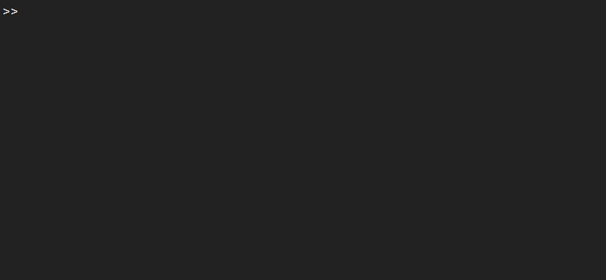

# Installation
{: .no_toc }

### Getting SOROTOKI
{: .text-purple-000}
The toolkit is easy to install. The fastest and easiest way to acquire the toolkit is through [**git**](https://git-scm.com/downloads). You can directly clone the repository using the command:

```fortran
 git clone https://github.com/BJCaasenbrood/SorotokiCode.git
```

Alternatively, you can download the latest stable version of the toolkit below, and unpack the compressed folder at any desired working directory. 

[Stable V3.03 (.zip)](https://github.com/BJCaasenbrood/SorotokiCode/zipball/master){: .btn .btn .fs-3 .mb-4 .mb-md-0 .mr-2}  [Stable V3.03 (.tar)](https://github.com/BJCaasenbrood/SorotokiCode/tarball/master){: .btn .btn .fs-3 .mb-4 .mb-md-0 .mr-2} [Download from Github](https://github.com/BJCaasenbrood/SorotokiCode){: .btn .fs-3 .mb-4 .mb-md-0}  


### Open MATLAB
{: .text-purple-000}
- MATLAB compatibility: R2018a/R2018b/R2020a.
- OS compatibility: Windows/Linux.

Please inform the developers if any compatibility issues may occur.

### Running the installation script
{: .text-purple-000}

Before you get started, you first have to configure the toolkit with MATLAB's function paths. Setting up these paths is relatively straightforward. Simply run `sorotoki.m`{: .text-purple-000}:

 

During the installation, the toolkit will ask you if the SOROTOKI directory should be set to the *main* directory of MATLAB, so every-time you open MATLAB it will automatically go this directory. 

By using the command: `cdsoro`{: .text-purple-000}, you can quickly go back to this main directory from any other directory (super useful!). It will also generate the file `startup.m`{: .text-purple-000} that loads the toolkit automatically. This start-up file is commonly located under `./Documents/MATLAB/startup.m` 

### That's it!
{: .text-purple-000}
The soft robotics toolkit is now ready-to-use. 

### Checking for future updates
{: .text-purple-000}
It is also worth mentioning that the command above is also used to update the toolkit. It is recommended to run `sorotoki()`{: .text-purple-000} to check for updates occasionally. 


# Getting started quickly
To get started with some preliminary demos, type the following line in the command window:
```rust
% show demos
sorotoki('demo');
```

