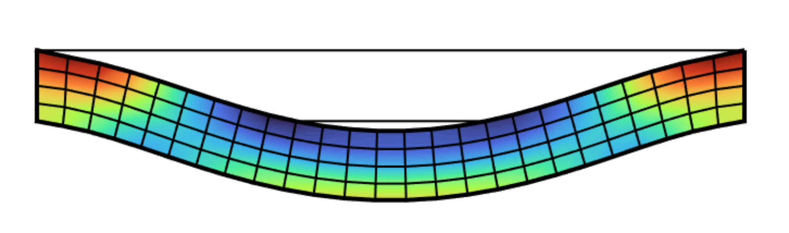
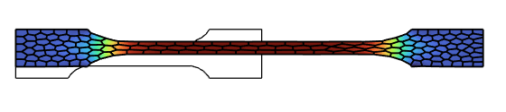
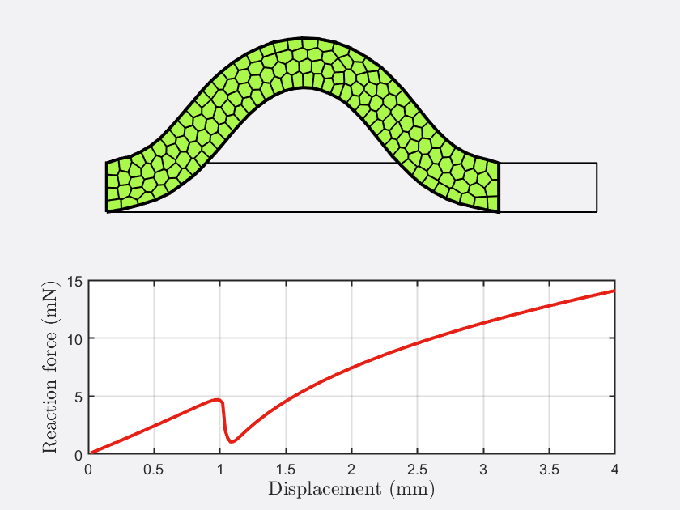

# Finite element method
[**Sorotoki**](https://bjcaasenbrood.github.io/SorotokiCode/) includes a finite element solver able to deal with linear and nonlinear problems. The class [`Fem.m`](./finite-elements.html) works coherently with [`Mesh.m`](./meshing.html). The finite element toolkit offers a set of material models - including Hookean, Neo-Hookean, Mooney-Rivlin, and Yeoh - that should cover for a wide range of soft materials. Furthermore, we also provides some preset material models that are known to be used extensively in soft robotics research. Examples included: Ecoflex-0030, Dragonskin-30A, Elastosil, and NinjaFlex.

For generating the mesh, we refer the reader to [`Mesh`](./meshing.html). 

### List of material models:
```matlab
% different material models
fem.Material = LinearMaterial('E',-,'Nu',-);           
fem.Material = NeoHookeanMaterial('E',-,'Nu',-);     
fem.Material = MooneyMaterial('C10',-,'C01',-,'K',-); 
fem.Material = YeohMaterial('C1',-,'C2',-,'C3',-)  
                            
% different preset materials
fem.Material = Ecoflex0030();
fem.Material = Dragonskin20A();   	 
fem.Material = Elastosil();   	 
fem.Material = TPU90();   	 
```

# Numerical examples

### Example: Clamped beam 
```matlab
%% generate mesh from sdf
sdf = @(x) dRectangle(x,0,20,0,2);

msh = Mesh(sdf,'BdBox',[0,20,0,2],'Quads',[25 4]);
msh = msh.generate();

%% generate fem model from mesh
fem = Fem(msh,'TimeStep',1/25);

%% add boundary conditions
fem = fem.AddConstraint('Support',fem.FindNodes('Left'),[1,1]);
fem = fem.AddConstraint('Support',fem.FindNodes('Right'),[1,1]);
fem = fem.AddConstraint('Load',fem.FindNodes('Bottom'),[0,-1e-3]);

%% select material
fem.Material =  Dragonskin10A;

%% solving
fem.solve();
```

<div align="center">  </div>

### Example: Tensile bone
```matlab
%% generate mesh from sdf
sdf = @(x) TensileBone(x,10,2,4,1,1);

msh = Mesh(sdf,'BdBox',[0,10,0,10],'NElem',150);
msh = msh.generate();

%% generate fem model from mesh
fem = Fem(msh,'TimeStep',1/100,'PrescribedDisplacement');

%% add boundary conditions
fem = fem.AddConstraint('Support',fem.FindNodes('Left'),[1,0]);
fem = fem.AddConstraint('Support',fem.FindNodes('Bottom'),[0,1]);
fem = fem.AddConstraint('Load',fem.FindNodes('Top'),[0,9]);
fem = fem.AddConstraint('Output',fem.FindNodes('Location',[1,4]),[0,1]);

%% assign material
fem.Material = Ecoflex0030();

%% solving
fem.solve();

%% plotting
fem.show('Svm'); view(90,90);

function D = TensileBone(P,H,W,T,D,R)
dD = 0.5*(W-D);
dT = 0.5*(H-T);

R1 = dRectangle(P,0,W,0,H);
R2 = dRectangle(P,0,dD,dT,dT+T);
R3 = dRectangle(P,W-dD,W,dT,dT+T);
C1 = dCircle(P,dD-R,dT,R);
C2 = dCircle(P,dD-R,dT+T,R);
C3 = dCircle(P,W-dD+R,dT,R);
C4 = dCircle(P,W-dD+R,dT+T,R);
D0 = dDiff(dDiff(dDiff(R1,R2),C1),C2);
D = dDiff(dDiff(dDiff(D0,R3),C3),C4);
end
```
<div align="center">  </div>

### Example: Buckling beam 
```matlab
%% generate mesh from sdf
sdf = @(x) dRectangle(x,0,20,0,2);

msh = Mesh(sdf,'BdBox',[0,20,0,2],'NElem',150);
msh = msh.generate();

%% generate fem model from mesh
fem = Fem(msh,'TimeStep',1/200,'PrescribedDisplacement',true);

%% add boundary condition
fem = fem.AddConstraint('Support',fem.FindNodes('Left'),[1,1]);
fem = fem.AddConstraint('Support',fem.FindNodes('SE'),[0,1]);
fem = fem.AddConstraint('Support',fem.FindNodes('NE'),[0,1]);
fem = fem.AddConstraint('Load',fem.FindNodes('Right'),[-4,0]);

%% add logger nodes
fem = fem.AddConstraint('Output',fem.FindNodes('SE'),[0,0]);

%% assign material
fem.Material = Ecoflex0030();

%% solving
fem.solve();

%% plot force-displacement relation
figure(101);
subplot(2,1,1); fem.show();
subplot(2,1,2); plot(fem.Log{2,3},fem.Log{2,6},'linewidth',2,'Color',col(2));
xlabel('Displacement (mm)','interpreter','latex','fontsize',12);
ylabel('Reaction force (N)','interpreter','latex','fontsize',12);
grid on; set(gca,'linewidth',1);
```

<div align="center">  </div>
