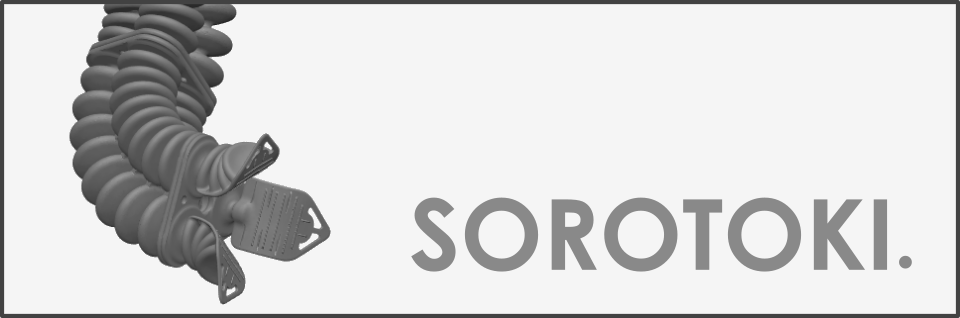

 

  
  

[**Sorotoki**](https://bjcaasenbrood.github.io/SorotokiCode/) is an open-source MATLAB toolkit that includes an array of modeling and designing tools for soft robotics. Due to its scientific diversity, exploring the field of soft robotics can be significantly challenging. With the aim to bridge this multi-disciplinary gap, Sorotoki aims to incorporate several layers of scientific disciplines in one toolkit. Examples include: continuum mechanics, dynamic system- and control theory, topology optimization, computer graphics, and much more! 
