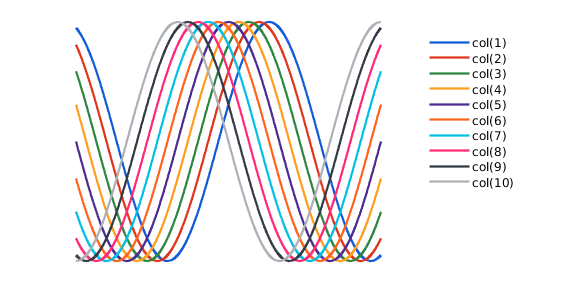

# Colors

The standard color schemes are not optimized well (in my opinion). Especially when compared to the [MatplotLib](https://matplotlib.org/) in Python. Therefore, Sorotoki comes equipped with a new color scheme.

##### Improved color scheme for plotting lines

???+ example "Using Sorotoki color scheme(s)"
    ``` matlab
    fig(101,[10,9]);

    for ii=1:10
        X = linspace(0,pi*3,1e5);
        Y = cos(X+1*ii*pi/N);
        plot(X,Y);
    end

    % magick color change
    sorocolor;
    ```
    <figure markdown>
    { loading=lazy }
    <figcaption>Improved color scheme for plotting using Sorotoki</figcaption>
    </figure>

    ??? info "Alternative option"
        An alternative option is to call the colors directly. We can use this using `col(i)` where `i` is the color index. The indexation is identical to the legend above.
        ``` matlab
        fig(101,[10,9]);

        for ii=1:10
            X = linspace(0,pi*3,1e5);
            Y = cos(X+1*ii*pi/N);
            plot(X,Y,'Color',col(ii));
        end
        ```
