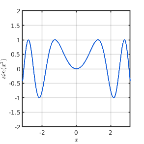
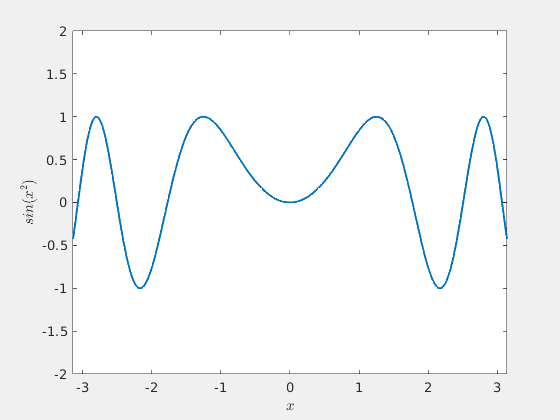

# Figures

Making figures in Matlab is hassle some. By default, the background is gray instead of white. The line thickness is `0.5pt` instead of a prettier `1.5pt`. Also the bounding box of the graphs are not `1.0pt` but instead `0.5pt`. And the labels are by default not using the `.latex` interpreter. To make matters worse, we cannot scale figure size by default -- rather a set of commands are required to adjust figure size.

To solve this, we introduce the `fig()` command.

???+ example "Making a *fig* figure"
    ``` matlab
    % make figure of size (2^9) x (2^9) = 512 x 512 px
    fig(101,[9,9]);
    ezplot(@(x) sin(x^2));

    xlabel('$x$');
    ylabel('$\sin(x^2)$');
    ```

    ???+ tip "Sorotoki figure"
        <figure markdown>
        { height="600" }
        <figcaption> Figure of size 512x512 pixels produced using fig()</figcaption>
        </figure>

    ??? error inline "How about standard Matlab?"
        { width=120 }
        <figure markdown>
        { height="600" }
        <figcaption> Standard matlab figure result <br></figcaption>
        </figure>