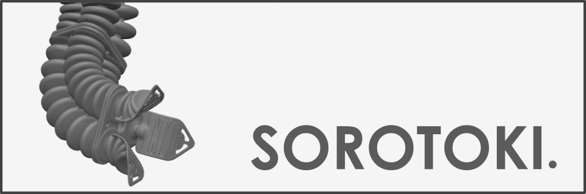

<script src="https://cdn.mathjax.org/mathjax/latest/MathJax.js?config=TeX-AMS-MML_HTMLorMML" type="text/javascript"></script> 
<div align="center">  </div> <br/>

[**Sorotoki**](https://bjcaasenbrood.github.io/SorotokiCode/) is an open-source MATLAB toolkit that includes an array of modeling and designing tools for soft robotics. This toolkit brings together various scientific disciplines within the field of soft robotics, including continuum mechanics, dynamical system- and control theory, shape- and topology optimization, computer graphics, and many more! 

# Installation
Download the latest stable version ([.zip](https://github.com/BJCaasenbrood/SorotokiCode/zipball/master) or [.tar](https://github.com/BJCaasenbrood/SorotokiCode/tarball/master)) and unpack the compressed folder at any desired work directory. To install the toolkit, simply run the command below. That's it, the soft robotics toolkit is now ready-to-use.
```matlab
% installation command
sorotoki();
```

# Getting started
The Matlab toolkit consists of a library of objected-oriented functions for modeling and developing soft robots. Each object-oriented function integrate seamlessly with one another and, to some extent, bridges the gaps between different scientific disciplines. For instance, *Mesh()* and *Fem()* provide numerical tools to deals with the continuum mechanical behavior of soft materials, whose extrapolated material models can be integrated into the dynamic model description with the class *Model()*. The main Classes of Sorotoki are shown below:

```matlab
% list of classes
msh = Mesh();	 % meshing class
fem = Fem();   	 % finite elements class
obj = Gmodel();  % graphics model class
mdl = Model();   % dynamical model class
```

To get started, type the following line in the command window:
```matlab
% installation command
sorotoki('demo');
```

# Documentation and libary usage
* [**Mesh generation**](./bin/Mesh.md). 
* [**Finite Element Method**](./bin/Fem.md).
* [**Topology Optimization**](./bin/Topo.md).
* [**Graphics and Rendering**](./bin/Gmodel.md).
* [**Dynamical Modeling**](./bin/Model.md).


## Citation
If you are using Sorotoki in your academic work, please consider to cite the toolkit:
```
@misc{Caasenbrood2018,
  author = {Caasenbrood, Brandon},
  title = {Sorotoki - A Soft Robotics Toolkit for MATLAB},
  year = {2018},
  publisher = {GitHub},
  journal = {GitHub repository},
  howpublished = {\url{https://github.com/BJCaasenbrood/SorotokiCode}},
  }
```

## Bibliography
[1] B. Caasenbrood, A. Pogromsky, and H. Nijmeijer, *A Computational Design Framework for Pressure-driven Soft Robots through Nonlinear Topology Optimization*, RoboSoft 2020 - IEEE International Conference on Soft Robotics, 2020.

[2] B. Caasenbrood, A. Pogromsky, and H. Nijmeijer, *Dynamic modeling of hyper-elastic soft robots using spatial curves,* IFAC World Congress, 2020.

[3] C. Talischi, G. H. Paulino, A. Pereira, and I. F. M. Menezes, *PolyMesher: A general-purpose mesh generator for polygonal elements written in Matlab*, Struct. Multidiscip. Optim., vol. 45, no. 3, pp. 309–328, 2012.

[4] N. Kim, *Introduction Analysis Finite Element to Nonlinear*. 2018.

[5] M. Bendsoe and O. Sigmund, *Topology Optimization. Theory, Methods and Applications*. 2003.


