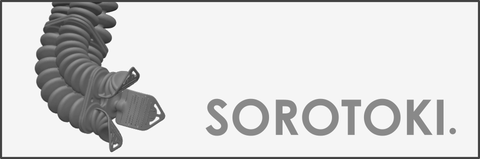

<script src="https://cdn.mathjax.org/mathjax/latest/MathJax.js?config=TeX-AMS-MML_HTMLorMML" type="text/javascript"></script> 
<div align="center">  </div>

Sorotoki is an open-source MATLAB toolkit that includes an array of modeling and designing tools for soft robotics. The toolkit aims to bring together the various scientific disciplines within the field of soft robotics, e.g., continuum mechanics, dynamical system- and control theory, and computer graphics. 

# Installation
Download the latest stable version ([zip](https://github.com/BJCaasenbrood/SorotokiCode/zipball/master) or [tar](https://github.com/BJCaasenbrood/SorotokiCode/tarball/master)) and unpack the compressed folder at any desired work directory. To install the toolkit, simply run the command below. That's it, the soft robotics toolkit is now ready-to-use.
```matlab
% installation command
sorotoki();
```

# Getting started
The main class of **ToPy** is 'Topology'. It defines the main constraints, grid and parameters of optimization -- but you don't really have to bother yourself with this if you just want to get some results.
```matlab
% list of classes
msh = Mesh();	 % meshing class
fem = Fem();   	 % finite elements class
obj = Gmodel();  % graphics model class
mdl = Model();   % dynamical model class
```

# Nonlinear Finite Elements
[**Nonlinear Finite Elements**](./bin/Fem.md).

### Libary of material classes:
```matlab
% different material models
fem.Material = LinearMaterial('E',-,'Nu',-);           % linear isotropic
fem.Material = NeoHookeanMaterial('E',-,'Nu',-);       % neo-hookean model
fem.Material = MooneyMaterial('C10',-,'C01',-,'K',-);  % mooney-rivlin model
fem.Material = YeohMaterial('C1',-,'C2',-,'C3',-)      % yeoh model
                            
% different preset materials
fem.Material = Ecoflex0030();
fem.Material = Dragonskin20A();   	 
fem.Material = Elastosil();   	 
```

### Example: Beam 
```matlab
%% generate mesh from sdf
sdf = @(x) dRectangle(x,0,10,0,2);

msh = Mesh(sdf);
msh = msh.set('BdBox',[0,10,0,2],'NElem',500);
msh = msh.generateMesh;

%% generate fem model from mesh
fem = Fem(msh);
fem = fem.set('TimeStep',1/15,'ResidualNorm',1e-3);

%% add boundary conditions 
fem = fem.AddConstraint('Support',fem.FindNodes('Left'),[1,1]);
fem = fem.AddConstraint('Load',fem.FindNodes('Right'),[0,-2e-3]);

%% assign material
fem.Material = Ecoflex0030;

%% solving
fem.solve();
```

# Citation
If you are using Sorotoki in your academic work, please consider to cite the toolkit:
```
@misc{Caasenbrood2018,
  author = {Caasenbrood, Brandon},
  title = {Sorotoki - A Soft Robotics Toolkit for MATLAB},
  year = {2018},
  publisher = {GitHub},
  journal = {GitHub repository},
  howpublished = {\url{https://github.com/BJCaasenbrood/SorotokiCode}},
  }
```

# References
[1] B. Caasenbrood, A. Pogromsky, and H. Nijmeijer, *A Computational Design Framework for Pressure-driven Soft Robots through Nonlinear Topology Optimization*, RoboSoft 2019 - 2019 IEEE International Conference on Soft Robotics, 2020.

[2] N. Kim, *Introduction Analysis Finite Element to Nonlinear*. 2018.

[3] M. Bendsoe and O. Sigmund, *Topology Optimization. Theory, Methods and Applications*. 2003.


